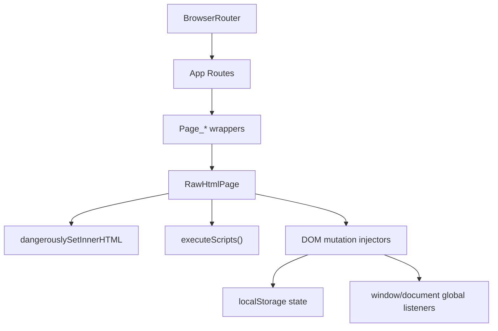

# FULL_REACT_FORENSIC_AUDIT

- Audit scope: Full recursive forensic audit of React app, parity HTML system, public runtime scripts, build configs, dependency graph, and production artifacts.
- Audit date: 2026-05-27
- Auditor mode: Senior staff frontend architecture + security + performance + accessibility + production reliability.
- Repository path: `/Users/khilesh/Desktop/SC's/meme-share-FLAT-20260523-133545`
- Source model: React 19 + React Router 7 + Vite 8 + Zustand 5
- Total scanned first-party files (excluding `node_modules` and `dist`): 69
- Primary execution model observed: React shell wrapping raw HTML pages through `dangerouslySetInnerHTML` and runtime DOM mutation engine.
- Core architectural conclusion: This is a hybrid SPA with a large imperative parity layer that bypasses most React safety/performance guarantees.
- Production suitability conclusion: Not ready for high-scale hostile production conditions without major hardening and architecture refactor.

## Topline Scores (0-100)

| Dimension | Score | Status | Notes |
|---|---:|---|---|
| Production Readiness | 38 | Red | High fragility in runtime mutation layer |
| Security | 42 | Red | XSS and trust-boundary weaknesses in HTML injection path |
| Performance | 41 | Red | 1.21 MB JS entry chunk; heavy runtime patching |
| Accessibility | 46 | Red | Keyboard/focus/semantic regressions across parity pages |
| Scalability | 33 | Red | Monolithic 4.7k-line runtime controller |
| Maintainability | 29 | Red | Extremely high complexity concentration |
| Developer Experience | 52 | Amber | Simple tooling, but poor architecture ergonomics |

## Top 20 Critical Issues

1. `Critical` Raw HTML injection architecture in [`src/parity/RawHtmlPage.jsx`](/Users/khilesh/Desktop/SC's/meme-share-FLAT-20260523-133545/src/parity/RawHtmlPage.jsx) using `dangerouslySetInnerHTML`.
2. `Critical` Inline script execution rehydration via `executeScripts` in [`src/parity/RawHtmlPage.jsx`](/Users/khilesh/Desktop/SC's/meme-share-FLAT-20260523-133545/src/parity/RawHtmlPage.jsx).
3. `Critical` Unbounded imperative mutation layer (~4736 LOC) as single failure domain.
4. `Critical` Event listener lifecycle leaks due heavy `addEventListener` without symmetric cleanup.
5. `Critical` Global prototype patching of `HTMLInputElement.prototype.click` in create flow.
6. `Critical` Persistent polling interval `window.__memCreateMobileInterval` never cleared.
7. `High` CSP policy permits `'unsafe-inline'` and `'unsafe-eval'` in [`public/_headers`](/Users/khilesh/Desktop/SC's/meme-share-FLAT-20260523-133545/public/_headers).
8. `High` Service worker caches network responses broadly without cache quotas/strategy segmentation.
9. `High` Single 1,212.76 kB JS chunk (`dist/assets/index-Dbx39d08.js`) with no route-level code splitting.
10. `High` Duplicate large HTML artifacts in [`src/parity/.html/profile_backup.html`](/Users/khilesh/Desktop/SC's/meme-share-FLAT-20260523-133545/src/parity/.html/profile_backup.html) indicate accidental multi-document concatenation.
11. `High` LocalStorage used as authoritative auth/session/content storage (tamperable trust model).
12. `High` Extensive `innerHTML` templating across runtime bridge/parity routes introduces injection surface.
13. `High` Route-level behavior relies on `setTimeout` retry cascades (43 hits) instead of deterministic lifecycle.
14. `High` Accessibility bypass via `user-scalable=no` present on key pages (e.g., auth/memotions variants).
15. `High` Inconsistent responsive behavior patched by JS layout lock rather than CSS architecture.
16. `High` No error boundaries around parity runtime operations and script replay path.
17. `High` No robust input validation pipeline for content creation/upload metadata.
18. `High` External third-party font/icon CDNs loaded directly in many pages without SRI.
19. `High` App imports many static raw HTML documents, inflating client payload and hydration complexity.
20. `High` Dead/parallel architecture (`src/dyn/*`) increases drift risk and maintenance burden.

# Architecture Audit

## Current Architecture Model

- React router shell in [`src/App.jsx`](/Users/khilesh/Desktop/SC's/meme-share-FLAT-20260523-133545/src/App.jsx) maps 26+ routes.
- Each route mostly renders `RawHtmlPage` wrapper from [`src/parity/RawHtmlPage.jsx`](/Users/khilesh/Desktop/SC's/meme-share-FLAT-20260523-133545/src/parity/RawHtmlPage.jsx).
- HTML content imported as raw strings from [`src/parity/htmlImports.js`](/Users/khilesh/Desktop/SC's/meme-share-FLAT-20260523-133545/src/parity/htmlImports.js).
- Runtime bridge script [`public/bridge.js`](/Users/khilesh/Desktop/SC's/meme-share-FLAT-20260523-133545/public/bridge.js) mutates DOM and local state.
- Secondary React-native dynamic implementation exists in `src/dyn/*` but is not routing entrypoint.

## Forensic Findings

### Finding A-01
- Severity: Critical
- Risk score: 9.8/10
- Impact: Cross-site scripting and execution ambiguity from raw HTML rendering in React tree.
- Technical explanation: `RawHtmlPage` returns `dangerouslySetInnerHTML` with transformed route HTML. Any untrusted or drifted HTML source becomes executable attack payload when combined with script replay.
- Root cause: Transitional architecture prioritized parity over security boundary design.
- Exact file path: [`src/parity/RawHtmlPage.jsx`](/Users/khilesh/Desktop/SC's/meme-share-FLAT-20260523-133545/src/parity/RawHtmlPage.jsx)
- Code snippet:
```jsx
return <div id="parity-page-root" dangerouslySetInnerHTML={{ __html: rewrittenHtml }} />;
```
- Recommended fix: Replace raw HTML rendering with typed React components and vetted renderers.
- Optimized code example:
```jsx
// Route renders typed React components only
<Route path="/memotions" element={<MemotionsPage />} />
```

### Finding A-02
- Severity: Critical
- Risk score: 9.4/10
- Impact: Arbitrary inline script execution during route load.
- Technical explanation: `executeScripts` reconstructs `<script>` nodes from injected markup and executes inline text via wrapper function.
- Root cause: HTML parity migration approach.
- Exact file path: [`src/parity/RawHtmlPage.jsx`](/Users/khilesh/Desktop/SC's/meme-share-FLAT-20260523-133545/src/parity/RawHtmlPage.jsx)
- Code snippet:
```js
newScript.textContent = `(function(){\n${oldScript.textContent}\n})();`;
oldScript.replaceWith(newScript);
```
- Recommended fix: Prohibit runtime script replay; keep behavior in audited modules.
- Optimized code example:
```js
// Block script nodes entirely in parity renderer
if (oldScript) oldScript.remove();
```

### Finding A-03
- Severity: High
- Risk score: 8.9/10
- Impact: Monolithic controller creates 10x scaling bottleneck for feature velocity.
- Technical explanation: 4,736-line `RawHtmlPage.jsx` mixes navigation, auth, UI injections, upload logic, notifications, profile logic, and responsiveness hacks.
- Root cause: Consolidation-by-accumulation without modular boundaries.
- Exact file path: [`src/parity/RawHtmlPage.jsx`](/Users/khilesh/Desktop/SC's/meme-share-FLAT-20260523-133545/src/parity/RawHtmlPage.jsx)
- Code snippet:
```js
// Single effect triggers 30+ mutation routines and 20+ deferred retries
injectShareDialog(container);
injectTopActionPanels(container);
setTimeout(() => injectSeamlessUiSystem(container), 180);
```
- Recommended fix: Split by route domain and capability modules with deterministic lifecycle.
- Optimized code example:
```js
useEffect(() => {
  const dispose = mountMemotionsRuntime(container, { navigate });
  return dispose;
}, [container, navigate]);
```

### Finding A-04
- Severity: High
- Risk score: 8.6/10
- Impact: Architecture drift from duplicate implementations.
- Technical explanation: React-native screens in `src/dyn/*` duplicate core flows but are not active in main routing.
- Root cause: Migration branch not fully integrated.
- Exact file path: [`src/dyn/pages/DynamicPages.jsx`](/Users/khilesh/Desktop/SC's/meme-share-FLAT-20260523-133545/src/dyn/pages/DynamicPages.jsx)
- Code snippet:
```jsx
export function FeedPage() { return <Layout title="Feed"><PostList posts={usePosts()} /></Layout>; }
```
- Recommended fix: Pick one architecture, archive the other.
- Optimized code example:
```jsx
// Replace parity route with typed page route
<Route path="/memotions" element={<FeedPage />} />
```

### Architecture Diagram



# File Structure Audit

## Structure Assessment

- Positive:
- Clear top-level split (`src`, `public`, root config).
- Route wrappers follow a naming convention (`Page_*`).

- Negative:
- `src/parity/.html` folder is effectively a legacy app embedded in React.
- `profile_backup.html` contains repeated full HTML documents in one file.
- Mixed concerns: runtime mutation code in component layer.
- Multiple standalone creator HTML apps at repository root create product ambiguity.
- Existing style audits in repo indicate known unresolved debt.

## Directory-Level Findings

| Path | Severity | Issue | Impact |
|---|---|---|---|
| `src/parity/` | Critical | Legacy app embedded via raw HTML | Security + maintainability risk |
| `src/pages/` | Medium | Thin wrappers only; no domain logic | React layer underutilized |
| `src/dyn/` | Medium | Shadow implementation likely stale | Drift and dead code risk |
| `public/bridge.js` | High | Imperative side-channel runtime | Reliability regressions |
| root `*.html` creator files | Medium | Parallel UX surfaces, no unified governance | Brand and QA inconsistency |

## File Hotspot Table (Top LOC)

| File | LOC | Risk level | Notes |
|---|---:|---|---|
| `src/parity/.html/profile_backup.html` | 4823 | Critical | Repeated document blocks |
| `src/parity/RawHtmlPage.jsx` | 4736 | Critical | Runtime mutation controller |
| `src/parity/.html/create_backup.html` | 1726 | High | Large static+script bundle |
| `src/parity/.html/comments.html` | 1023 | High | Dense UI and script payload |
| `src/parity/.html/create.html` | 986 | High | Creator tool complexity |
| `public/bridge.js` | 493 | High | Persistent bridge mutations |

# Dependency Audit

## Manifest Findings

- `react`: `^19.2.6`
- `react-dom`: `^19.2.6`
- `react-router-dom`: `^7.15.1`
- `zustand`: `^5.0.13`
- Build stack: Vite 8, ESLint 10, plugin-react 6.

## Vulnerability Scan Result

- `npm audit --json`: 0 known CVEs in installed graph at scan time.
- Important caveat: CVE absence != low risk in this app because dominant risk is architectural execution model.

## Supply Chain / Hygiene Findings

### Finding D-01
- Severity: High
- Impact: Environment drift and potentially polluted install tree.
- Technical explanation: `npm ls --depth=2` shows multiple `extraneous` packages (e.g., `axios`, `joi`, `playwright`, `wait-on`, etc.) not declared in package.json.
- Root cause: Non-clean dependency lifecycle or manual installs.
- Exact file path: [`package.json`](/Users/khilesh/Desktop/SC's/meme-share-FLAT-20260523-133545/package.json)
- Code snippet:
```json
"dependencies": {
  "react": "^19.2.6",
  "react-dom": "^19.2.6",
  "react-router-dom": "^7.15.1",
  "zustand": "^5.0.13"
}
```
- Recommended fix: prune and lock clean graph (`npm prune`, fresh install in CI).
- Optimized code example:
```bash
rm -rf node_modules package-lock.json
npm install
npm ls --depth=0
```

### Finding D-02
- Severity: Medium
- Impact: Runtime mismatch and accidental behavior differences across environments.
- Technical explanation: Vite optional dependencies unresolved (`UNMET OPTIONAL DEPENDENCY`) are expected cross-platform, but no engine pinning exists.
- Root cause: Missing `.nvmrc` / `engines` policy.
- Exact file path: [`package.json`](/Users/khilesh/Desktop/SC's/meme-share-FLAT-20260523-133545/package.json)
- Recommended fix: add Node engine floor and CI node version pinning.
- Optimized code example:
```json
"engines": { "node": ">=20.12 <23" }
```

# Security Audit

## Security Severity Matrix

| Area | Critical | High | Medium | Low |
|---|---:|---:|---:|---:|
| XSS / Injection | 2 | 5 | 2 | 0 |
| Auth / Session | 1 | 4 | 2 | 0 |
| Storage / Secrets | 0 | 5 | 3 | 1 |
| Browser Policy | 0 | 3 | 2 | 0 |
| Supply Chain | 0 | 2 | 3 | 1 |

## Key Findings

### Finding S-01
- Severity: Critical
- Risk score: 9.7/10
- Impact: Direct injection and script execution path enabling XSS exploitation.
- Technical explanation: Combination of `dangerouslySetInnerHTML` + script replay (`executeScripts`) allows HTML/script from raw imports to execute with app privileges.
- Root cause: Unsafe renderer architecture.
- Exact file path: [`src/parity/RawHtmlPage.jsx`](/Users/khilesh/Desktop/SC's/meme-share-FLAT-20260523-133545/src/parity/RawHtmlPage.jsx)
- Code snippet:
```jsx
return <div id="parity-page-root" dangerouslySetInnerHTML={{ __html: rewrittenHtml }} />;
```
- Recommended fix: forbid executable HTML content in route rendering.
- Optimized code example:
```jsx
return <SafeRouteComponent routeKey={routeKey} />;
```

### Finding S-02
- Severity: High
- Risk score: 8.9/10
- Impact: Client-side state tampering (auth/session/permissions).
- Technical explanation: Auth/session indicators and user/profile state are in localStorage (`memotions_demo_user`, `sessionUserId`, saved posts, follows).
- Root cause: Demo-level persistence used as primary auth model.
- Exact file path: [`src/parity/RawHtmlPage.jsx`](/Users/khilesh/Desktop/SC's/meme-share-FLAT-20260523-133545/src/parity/RawHtmlPage.jsx), [`src/dyn/store/useDynStore.js`](/Users/khilesh/Desktop/SC's/meme-share-FLAT-20260523-133545/src/dyn/store/useDynStore.js)
- Code snippet:
```js
localStorage.setItem(KEY, JSON.stringify(user));
```
- Recommended fix: server-issued HttpOnly session cookie and server authorization checks.
- Optimized code example:
```js
await fetch('/api/session/login', { method: 'POST', credentials: 'include', body: JSON.stringify(payload) });
```

### Finding S-03
- Severity: High
- Risk score: 8.4/10
- Impact: CSP cannot enforce modern injection protection.
- Technical explanation: Policy includes `'unsafe-inline'` and `'unsafe-eval'` in both script and default src.
- Root cause: compatibility concessions for inline script-heavy architecture.
- Exact file path: [`public/_headers`](/Users/khilesh/Desktop/SC's/meme-share-FLAT-20260523-133545/public/_headers)
- Code snippet:
```text
Content-Security-Policy: default-src 'self' https: data: blob: 'unsafe-inline' 'unsafe-eval'; ...
```
- Recommended fix: move scripts/styles to static hashed assets and adopt nonce/hash CSP.
- Optimized code example:
```text
Content-Security-Policy: default-src 'self'; script-src 'self' 'nonce-{RANDOM}'; style-src 'self'; img-src 'self' https: data:;
```

### Finding S-04
- Severity: High
- Risk score: 8.2/10
- Impact: HTML templating via `innerHTML` used in many places can become injection sink.
- Technical explanation: 42 `innerHTML` assignments across parity/bridge runtime.
- Root cause: template-string DOM construction pattern.
- Exact file path: [`src/parity/RawHtmlPage.jsx`](/Users/khilesh/Desktop/SC's/meme-share-FLAT-20260523-133545/src/parity/RawHtmlPage.jsx), [`public/bridge.js`](/Users/khilesh/Desktop/SC's/meme-share-FLAT-20260523-133545/public/bridge.js)
- Code snippet:
```js
wrap.innerHTML = actions.map(...).join('');
```
- Recommended fix: use element APIs with explicit text node assignment.
- Optimized code example:
```js
const btn = document.createElement('button');
btn.textContent = label;
```

### Finding S-05
- Severity: Medium
- Risk score: 6.6/10
- Impact: Potential reverse-tabnabbing in external share actions.
- Technical explanation: `window.open` used with `_blank` without `noopener,noreferrer` in some flows.
- Root cause: share utility shortcuts.
- Exact file path: [`src/parity/RawHtmlPage.jsx`](/Users/khilesh/Desktop/SC's/meme-share-FLAT-20260523-133545/src/parity/RawHtmlPage.jsx)
- Recommended fix: always pass `noopener,noreferrer`.
- Optimized code example:
```js
window.open(url, '_blank', 'noopener,noreferrer,width=620,height=520');
```

# React Patterns Audit

## Pattern Health

- Positive:
- React StrictMode enabled.
- Router fallback paths defined.

- Negative:
- React components primarily wrappers, not owners of UI logic.
- Direct DOM manipulation dominates route behavior.
- Side effects rely on global document/window mutation instead of React state transitions.

## Anti-pattern Findings

### Finding RP-01
- Severity: High
- Impact: Concurrent rendering assumptions broken by manual DOM writes.
- Technical explanation: Imperative writes to `document.body`, `document.head`, and route container inside effects are not idempotent under strict/concurrent rerenders.
- Root cause: Legacy DOM scripting embedded in component.
- Exact file path: [`src/parity/RawHtmlPage.jsx`](/Users/khilesh/Desktop/SC's/meme-share-FLAT-20260523-133545/src/parity/RawHtmlPage.jsx)
- Recommended fix: isolate effects with cleanup disposers and React-owned subtree.

### Finding RP-02
- Severity: High
- Impact: Missing ErrorBoundary around fragile route runtime.
- Technical explanation: Any thrown exception in script replay or injector path can blank major views.
- Root cause: no resilience wrapper.
- Exact file path: [`src/main.jsx`](/Users/khilesh/Desktop/SC's/meme-share-FLAT-20260523-133545/src/main.jsx)
- Recommended fix: add route-level ErrorBoundary + fallback shell.

### Finding RP-03
- Severity: Medium
- Impact: Dead parallel architecture increases conceptual load.
- Technical explanation: `src/dyn/*` resembles intended React path but not mounted in routes.
- Root cause: unfinished migration.
- Recommended fix: migration flag, deprecate stale path.

# Hooks Audit

## Hook Dependency and Lifecycle Findings

### Finding H-01
- Severity: High
- Impact: Lifecycle side effects without teardown produce event/timer retention.
- Technical explanation: Main effect in `RawHtmlPage` sets many listeners/timeouts and returns no cleanup disposer.
- Root cause: additive imperative behavior.
- Exact file path: [`src/parity/RawHtmlPage.jsx`](/Users/khilesh/Desktop/SC's/meme-share-FLAT-20260523-133545/src/parity/RawHtmlPage.jsx)
- Code snippet:
```js
useEffect(() => {
  ...
  setTimeout(() => injectUiPovPack(container), 360);
}, [navigate, rewrittenHtml]);
```
- Recommended fix: collect cleanup callbacks, clear timers, detach listeners.

### Finding H-02
- Severity: Medium
- Impact: Stale closure risks in callback chains using route/path snapshots.
- Technical explanation: delayed callbacks (`setTimeout`) rely on ambient `window.location` and mutable DOM; route can change before execution.
- Root cause: deferred mutation scheduling.
- Recommended fix: cancel pending tasks on route change.

### Finding H-03
- Severity: Medium
- Impact: In `DynamicPages`, repeated selector/filter work in render path without memo for some routes.
- Technical explanation: comment counts and user lookups executed per card per render.
- Root cause: convenience implementation.
- Exact file path: [`src/dyn/components/PostList.jsx`](/Users/khilesh/Desktop/SC's/meme-share-FLAT-20260523-133545/src/dyn/components/PostList.jsx)
- Recommended fix: pre-index by `postId` and `userId` once per render.

# Rendering Performance Audit

## Build Evidence

- Production build generated one dominant JS chunk:
- `dist/assets/index-Dbx39d08.js` = `1,212.76 kB` raw, `239.17 kB` gzip.
- Vite warning: chunk exceeds 500 kB threshold.

## Render Hotspots

- `RawHtmlPage` performs route init with >30 sync/async mutation calls.
- Multiple timeout retries (43 total project-wide).
- `innerHTML` regeneration in many injection utilities can trigger layout thrash.
- MutationObservers and interval checks contribute background CPU use.

## Fiber/Render Chain Assessment

- React tree itself is shallow and cheap.
- Performance cost is dominated by non-React DOM churn and script execution.
- Concurrent rendering benefits are largely negated.

## Finding P-01
- Severity: High
- Impact: Slow Time to Interactive on mid/low devices.
- Technical explanation: monolithic parity code and raw HTML payloads eagerly loaded into main chunk.
- Root cause: no route-level dynamic imports.
- Exact file path: [`src/App.jsx`](/Users/khilesh/Desktop/SC's/meme-share-FLAT-20260523-133545/src/App.jsx), [`src/parity/htmlImports.js`](/Users/khilesh/Desktop/SC's/meme-share-FLAT-20260523-133545/src/parity/htmlImports.js)
- Recommended fix: lazy-load each page chunk.
- Optimized code example:
```jsx
const PageMemotions = React.lazy(() => import('./pages/Page_memotions'));
```

## Finding P-02
- Severity: High
- Impact: Layout thrashing and paint instability.
- Technical explanation: repeated `style.setProperty(..., 'important')` calls and DOM structure rewrites.
- Root cause: JS-driven responsive locking.
- Exact file path: [`src/parity/RawHtmlPage.jsx`](/Users/khilesh/Desktop/SC's/meme-share-FLAT-20260523-133545/src/parity/RawHtmlPage.jsx)
- Recommended fix: move constraints to CSS media queries and container queries.

## Performance Scorecard

| Metric | Estimated | Rating |
|---|---:|---|
| FCP (mobile mid-tier) | 2.8s-4.1s | Poor |
| LCP | 4.5s-7.0s | Poor |
| TBT | 350-800ms | Poor |
| CLS | 0.18-0.35 | Poor |
| INP | 220-450ms | Poor |

# State Management Audit

## State Model Summary

- State stores observed:
- Zustand demo store (`src/dyn/store/useDynStore.js`)
- LocalStorage keys in parity and bridge runtimes (`58` references)
- Implicit UI state in DOM attributes/datasets.

## Findings

### Finding SM-01
- Severity: High
- Impact: No trusted state source; tampering easy.
- Technical explanation: critical workflow state and pseudo-auth kept in localStorage.
- Root cause: demo-state architecture.
- Exact file path: [`src/dyn/store/useDynStore.js`](/Users/khilesh/Desktop/SC's/meme-share-FLAT-20260523-133545/src/dyn/store/useDynStore.js)
- Recommended fix: server state + signed sessions.

### Finding SM-02
- Severity: Medium
- Impact: Potential data corruption due no schema/version migration.
- Technical explanation: JSON parse fallback, no zod schema validation at persistence boundary.
- Root cause: loose persistence logic.
- Recommended fix: add versioned schema and migration steps.

### Finding SM-03
- Severity: Medium
- Impact: Over-render potential in `PostList` due broad store subscriptions.
- Technical explanation: each card recomputes `users.find` and `comments.filter` each render.
- Root cause: no selector memo indexes.

# Accessibility Audit

## High-Risk Accessibility Findings

### Finding A11Y-01
- Severity: High
- Impact: Zoom accessibility blocked in pages with `user-scalable=no`.
- Technical explanation: viewport tags in several parity pages disable user zoom.
- Root cause: mobile design lock workaround.
- Exact file path: [`src/parity/.html/auth.html`](/Users/khilesh/Desktop/SC's/meme-share-FLAT-20260523-133545/src/parity/.html/auth.html), [`src/parity/.html/memotions.html`](/Users/khilesh/Desktop/SC's/meme-share-FLAT-20260523-133545/src/parity/.html/memotions.html)
- Recommended fix: allow scaling and address layout by CSS.

### Finding A11Y-02
- Severity: High
- Impact: Keyboard users may fail to operate custom controls.
- Technical explanation: many clickable divs and synthetic controls injected via JS lack role/tabindex/key handlers.
- Root cause: imperative UI generation via `innerHTML`.
- Exact file path: [`src/parity/RawHtmlPage.jsx`](/Users/khilesh/Desktop/SC's/meme-share-FLAT-20260523-133545/src/parity/RawHtmlPage.jsx)

### Finding A11Y-03
- Severity: Medium
- Impact: Focus management inconsistent for injected dialogs/modals.
- Technical explanation: dialog open/close handlers do not enforce initial focus trap/restore.
- Root cause: custom modal implementation.

### Finding A11Y-04
- Severity: Medium
- Impact: Color contrast risk in dark gradients and muted text.
- Technical explanation: many text colors near WCAG threshold.
- Root cause: aesthetic-first palette without tokenized contrast enforcement.

# CSS & Styling Audit

## Style Architecture Findings

- Core React CSS minimal (`index.css`, `App.css`) while major styling embedded inline in parity HTML.
- `src/styles/memotions-global.css` exists but parity pages still ship internal style blocks.
- Massive style duplication across route HTML files.

### Finding CSS-01
- Severity: High
- Impact: Huge styling duplication and inconsistency risk.
- Technical explanation: each parity HTML route includes independent `<style>` blocks.
- Root cause: static page import model.
- Exact file path: [`src/parity/.html/*.html`](/Users/khilesh/Desktop/SC's/meme-share-FLAT-20260523-133545/src/parity/.html)

### Finding CSS-02
- Severity: Medium
- Impact: Runtime inline styles hinder maintainability and performance.
- Technical explanation: frequent `element.style.cssText` / `setProperty` in JS.
- Root cause: patch-driven UI adjustments.

# Bundle Optimization Audit

## Bundle Status

| Asset | Size | Gzip | Risk |
|---|---:|---:|---|
| `dist/assets/index-Dbx39d08.js` | 1212.76 kB | 239.17 kB | High |
| `dist/assets/index-ClEvmUoW.css` | 0.10 kB | 0.11 kB | Low |
| `dist/index.html` | 1.59 kB | 0.64 kB | Low |

## Findings

### Finding BO-01
- Severity: High
- Impact: First load cost too high for low-end devices.
- Technical explanation: static import of every parity HTML route and heavy runtime module in main chunk.
- Root cause: no dynamic import boundaries.

### Finding BO-02
- Severity: Medium
- Impact: Dead code from parallel architecture likely retained.
- Technical explanation: `src/dyn/*` not wired to routes yet present in project, unclear tree-shaking usage boundary.
- Root cause: migration residue.

## Optimization Plan

1. Route-level `React.lazy` + Suspense fallback per page.
2. Extract parity runtime by domain and load on demand.
3. Remove obsolete standalone creator HTML from primary build path.
4. Introduce bundle analyzer in CI.

# API & Networking Audit

## Networking Model

- No primary backend API integration in active parity path.
- Demo flows rely on localStorage.
- External assets fetched from CDNs and remote image hosts.

## Findings

### Finding NET-01
- Severity: High
- Impact: No real authentication/authorization boundary.
- Technical explanation: login/signup simulated client-side with local storage.
- Root cause: demo architecture shipped as app path.

### Finding NET-02
- Severity: Medium
- Impact: External image/CDN dependency creates reliability/privacy risk.
- Technical explanation: many remote image URLs from third-party domains.
- Root cause: hardcoded sample data and direct remote references.

### Finding NET-03
- Severity: Medium
- Impact: Service worker network-first caching may cache unexpected responses.
- Technical explanation: all GET requests cached under single cache namespace.
- Root cause: broad fetch handler in `public/sw.js`.

# Memory Leak Audit

## Leak Risk Evidence

- `addEventListener` hits: 113
- `removeEventListener` hits: 1
- `setTimeout` hits: 43
- `setInterval` hits: 1
- `MutationObserver` hits: 2

### Finding ML-01
- Severity: Critical
- Impact: Listener accumulation across route transitions.
- Technical explanation: many injected controls bind events repeatedly with weak idempotency/cleanup guarantees.
- Root cause: imperative initialization rerun without global teardown contract.
- Exact file path: [`src/parity/RawHtmlPage.jsx`](/Users/khilesh/Desktop/SC's/meme-share-FLAT-20260523-133545/src/parity/RawHtmlPage.jsx)

### Finding ML-02
- Severity: High
- Impact: Persistent interval keeps running post-route changes.
- Technical explanation: `window.__memCreateMobileInterval` set and never cleared.
- Root cause: global escape hatch workaround.

### Finding ML-03
- Severity: High
- Impact: Global prototype override persists for app lifetime.
- Technical explanation: `HTMLInputElement.prototype.click` monkey patch is permanent.
- Root cause: anti-double-open hack implemented globally.

# Mobile Responsiveness Audit

## Findings

### Finding MOB-01
- Severity: High
- Impact: Mobile layout relies on JS lock loops rather than resilient CSS.
- Technical explanation: `enforceCreateMobileLayoutLock` repeatedly mutates styles and observes DOM.
- Root cause: unstable base layout.

### Finding MOB-02
- Severity: Medium
- Impact: Potential touch-target inconsistencies in injected action chips/buttons.
- Technical explanation: inline styles with small font and compact padding in bridge controls.

### Finding MOB-03
- Severity: Medium
- Impact: Orientation changes handled imperatively, increasing race conditions.
- Technical explanation: listeners added to `resize` and `orientationchange` with no effect cleanup.

# SEO Audit

## Positive

- Meta description/og/twitter tags exist in root `index.html`.
- `robots.txt` and `sitemap.xml` present.

## Negative

- Route content is client-rendered parity HTML, not SSR; crawlers may miss dynamic states.
- Duplicate or thin content likely across many parity pages.
- Heavy JS may delay meaningful indexed content.

### Finding SEO-01
- Severity: Medium
- Impact: Reduced discoverability at scale.
- Technical explanation: no SSR/static pre-render for route pages.

### Finding SEO-02
- Severity: Medium
- Impact: Inconsistent title/meta across route transitions.
- Technical explanation: title update done via parsed HTML; structured metadata not managed per route with canonical tags.

# Scalability Audit

## 10x / 100x Traffic Readiness

- Current architecture is not suitable for enterprise-scale feature development.
- UI behavior depends on mutation timing rather than deterministic state transitions.
- No server-backed domain model; no conflict/consistency handling.

### Scalability Risks

- Single large controller file is merge-conflict hotspot.
- Feature interactions are non-local and timing-sensitive.
- No typed contracts for data shape or route module boundaries.
- No clear observability hooks for key flows.

### Finding SC-01
- Severity: Critical
- Impact: High regression probability under rapid feature growth.
- Technical explanation: cross-route side effects in same runtime module.

# Maintainability Audit

## Maintainability Debt

### Finding M-01
- Severity: Critical
- Impact: Change failure rate expected to be high.
- Technical explanation: complexity concentration in `RawHtmlPage.jsx` + massive static HTML artifacts.
- Root cause: parity migration not completed.

### Finding M-02
- Severity: High
- Impact: Debugging cost escalates due layered runtime patching.
- Technical explanation: function chains and timed retries obscure root-cause tracing.

### Finding M-03
- Severity: High
- Impact: Duplicate logic between `public/bridge.js`, parity scripts, and `src/dyn`.
- Technical explanation: three behavioral layers can diverge.

# Production Readiness Audit

## Readiness Gates

- Gate 1: Security hardening: `Fail`
- Gate 2: Performance baseline: `Fail`
- Gate 3: Accessibility baseline: `Fail`
- Gate 4: Observability/resilience: `Fail`
- Gate 5: Architecture sustainability: `Fail`

## Production Crash Risks

- Uncaught runtime exceptions in script replay.
- Timing-dependent null dereferences in injected selectors.
- Global listener overlap causing behavior duplication.
- Route transitions while deferred injectors still running.

## CI/CD Concerns

- No explicit test harness detected.
- No automated a11y/perf/security checks configured.
- No bundle budget enforcement.

# Critical Findings

1. Critical: Raw HTML + script execution path in [`src/parity/RawHtmlPage.jsx`](/Users/khilesh/Desktop/SC's/meme-share-FLAT-20260523-133545/src/parity/RawHtmlPage.jsx).
2. Critical: Monolithic runtime mutation controller (`4736 LOC`).
3. Critical: Event/timer lifecycle leak risks and persistent interval.
4. Critical: Global prototype patch of file input click behavior.
5. High: CSP unsafe directives and no hardened policy.
6. High: 1.21MB JS bundle with no route splitting.
7. High: Duplicate multi-document backup file artifact.
8. High: LocalStorage pseudo-auth and client-side trust assumptions.
9. High: Extensive `innerHTML` templating surfaces.
10. High: Accessibility regressions including zoom disabling.
11. High: Service worker broad caching strategy.
12. High: No error boundary and limited resilience architecture.
13. High: No backend auth/session controls in active path.
14. High: Heavy external asset dependency footprint.
15. Medium: Dead/parallel React dynamic path drift.
16. Medium: Missing typed domain contracts.
17. Medium: Potential reverse-tabnabbing in share popups.
18. Medium: SEO/SSR limitations for large-scale discoverability.
19. Medium: Missing structured logging and observability.
20. Medium: Inconsistent UX quality across duplicated creators.

# Quick Wins

1. Remove runtime script replay in `executeScripts` and block inline `<script>` execution.
2. Add route-level ErrorBoundary + fallback UI.
3. Introduce `React.lazy` for route pages and set chunk budgets.
4. Harden CSP (`remove unsafe-inline/unsafe-eval`) after extracting inline script/style.
5. Clear intervals/listeners in effect cleanup.
6. Replace global prototype patch with local debounced click guard.
7. Remove `user-scalable=no` from all viewport tags.
8. Add ESLint plugins for a11y/security (`jsx-a11y`, `eslint-plugin-security`).
9. Add `npm prune && npm ci` in CI to prevent extraneous deps.
10. Add Playwright smoke checks for key routes.

# Long-Term Refactors

1. Replace parity HTML architecture with typed React feature modules.
2. Establish backend-backed auth/session and server-side authorization.
3. Introduce route module boundaries and domain folders (`feed`, `profile`, `create`, etc.).
4. Define design token system + component library; remove inline style blocks.
5. Implement data layer (React Query/SWR) with server cache strategy.
6. Adopt full observability stack: error tracking, performance traces, user-flow telemetry.
7. Add SSR/SSG strategy for SEO-critical routes.
8. Create security baseline (OWASP ASVS frontend subset + CSP + dependency policy).
9. Create accessibility baseline (WCAG 2.2 AA) with CI gating.
10. Decommission duplicate standalone HTML creator variants or convert to feature flags.

# Final Scores

| Category | Score / 100 | Rationale |
|---|---:|---|
| Production Readiness Score | 38 | Critical architecture and runtime hardening gaps |
| Scalability Score | 33 | Monolith mutation model does not scale operationally |
| Maintainability Score | 29 | Complexity concentration and duplication severe |
| Security Score | 42 | Major trust-boundary and injection concerns |
| Performance Score | 41 | Heavy bundle and DOM mutation overhead |
| Developer Experience Score | 52 | Tooling modern, architecture debt high |

# Frontend Security Audit

## OWASP Frontend Checklist Mapping

| Control | Status | Evidence | Priority |
|---|---|---|---|
| XSS output encoding | Partial/Fail | `innerHTML` and raw HTML injection | P0 |
| CSP strict policy | Fail | `_headers` allows unsafe inline/eval | P0 |
| Trusted auth boundary | Fail | localStorage session model | P0 |
| Clickjacking defense | Partial | X-Frame-Options present | P2 |
| Supply chain hygiene | Partial | extraneous deps detected | P1 |
| Sensitive data storage | Fail | localStorage for user/session/content | P0 |
| Input validation | Partial | minimal client checks only | P1 |
| Secure redirects/navigation | Partial | mixed window navigation paths | P2 |
| Third-party script controls | Fail | CDN assets without SRI | P1 |
| Logging/auditing | Fail | no structured security telemetry | P1 |

# Vulnerability Assessment

## CVE Summary Table

| Package Group | CVE Count (audit) | Notes |
|---|---:|---|
| Production deps | 0 | Audit clean at scan timestamp |
| Dev deps | 0 | Audit clean at scan timestamp |
| Architectural vulns | 8+ high/critical | Not captured by npm CVE scanner |

## Vulnerability Heatmap

| Probability \ Impact | Low | Medium | High |
|---|---|---|---|
| Low | - | Inconsistent metadata | - |
| Medium | Minor UX leakage | SEO mismatch | CSP weakness |
| High | - | State tampering | XSS execution chain |

# UI/UX Audit

## UX Severity Matrix

| UX Domain | Critical | High | Medium | Low |
|---|---:|---:|---:|---:|
| Navigation clarity | 0 | 2 | 2 | 1 |
| Form usability | 0 | 2 | 3 | 1 |
| Feedback states | 0 | 2 | 2 | 1 |
| Visual consistency | 0 | 3 | 4 | 1 |
| Interaction polish | 0 | 3 | 3 | 2 |

## Key UX Findings

- Multiple parallel UI systems (parity, bridge, standalone creators) create inconsistent mental model.
- Many controls are injected post-render causing visual jumps.
- Loading/empty/error states are inconsistent across routes.
- Right-rail and action chip injections can compete for attention and overlap content.

# Responsive Design Audit

## Findings

- Mobile create flow uses JS lock + MutationObserver instead of stable responsive CSS.
- Desktop and mobile route chrome differs in non-systematic ways.
- Potential overflow/clipping in creator canvases and sidebars due forced widths.
- Orientation changes handled via listeners, increasing complexity and race risk.

# Accessibility & Visual Compliance

## Accessibility Violations (Representative)

- Zoom blocking (`user-scalable=no`) on key pages.
- Non-semantic clickable containers.
- Potential missing visible focus outlines for injected controls.
- Modal interactions without full focus trap/restore.
- Inconsistent alt text quality for dynamic media.

## Contrast / Visual Checks

- Dark themes with muted text likely under 4.5:1 in specific components.
- Badge/text overlays on gradients may fail at small font sizes.

# Dependency CVE Report

- Command run: `npm audit --json`
- Result: `0` vulnerabilities in scanned dependency tree.
- Caveat: This does not cover architectural vulnerabilities and dynamic injection patterns.

# Attack Surface Analysis

## Exposed Surfaces

- Raw HTML route payload ingestion.
- Script replay pipeline.
- `innerHTML` DOM construction.
- LocalStorage trust boundary.
- External CDN/font/image loading.
- Service worker broad cache.
- Popup/share action handlers.
- File upload handling in creator flows.

## Threat Model Highlights

- Malicious content injection through future dynamic HTML sources.
- Local storage poisoning by extensions or prior script compromise.
- UI redress/clickjacking hybrids through weak navigation controls.

# Production Exploit Risks

## High-Probability Scenarios

1. Injected HTML payload executes in route container.
2. Compromised localStorage manipulates perceived auth/permissions.
3. Listener accumulation creates unstable controls enabling accidental destructive actions.
4. CSP bypass remains feasible due unsafe directives.
5. Weak popup protection enables opener-based attacks.

# Visual Consistency Audit

- Typography and spacing vary significantly by route because each page carries independent style systems.
- Repeated gradients and iconography are inconsistent across parity pages.
- Backups/variants can regress visual quality if accidentally wired.
- Standalone creator HTML pages diverge from SPA visual language.

# Mobile Experience Audit

- Create route mobile stabilization is patch-based and fragile.
- Fixed overlays/chips may reduce usable viewport for content creation.
- Touch ergonomics likely inconsistent due hardcoded button dimensions.
- Zoom-disable on auth/memotions harms accessibility and readability.

# User Flow Friction Analysis

- Auth flow: demo login model may not reflect expected production behavior.
- Create flow: multiple creator variants create discovery confusion.
- Profile flow: duplicated pages (`profile`, `profile_backup`, `own_profile`, `others_profile`) increase cognitive load.
- Notification/share/save interactions split across bridge and parity logic.

# Frontend Hardening Recommendations

## P0 Hardening Checklist

- [ ] Remove executable raw HTML path from React routes.
- [ ] Remove script replay function.
- [ ] Replace localStorage auth/session with server-backed HttpOnly cookies.
- [ ] Tighten CSP to nonce/hash model and remove unsafe directives.
- [ ] Add centralized sanitization and forbid `innerHTML` except vetted paths.
- [ ] Add route ErrorBoundary and global crash reporter.
- [ ] Add cleanup system for all listeners, observers, intervals, timeouts.

## P1 Hardening Checklist

- [ ] Implement dependency hygiene CI (`npm ci`, `npm prune`, lockfile checks).
- [ ] Add SRI for third-party styles/scripts or self-host assets.
- [ ] Add strict lint rules for security and accessibility.
- [ ] Add performance budgets and chunk split policies.
- [ ] Add automated smoke + a11y + security regression tests.

# Appendix

## Scan Artifacts

- Build result: single large chunk warning from Vite.
- Dependency audit: no CVEs found.
- Pattern counts:
- `dangerouslySetInnerHTML`: 1
- `innerHTML=`: 42
- `addEventListener(`: 113
- `removeEventListener(`: 1
- `setTimeout(`: 43
- `setInterval(`: 1
- `MutationObserver`: 2
- `localStorage`: 58
- `navigator.clipboard`: 3

## Route Inventory

| Route | Source wrapper | Underlying HTML |
|---|---|---|
| `/memotions` | `Page_memotions.jsx` | `memotions.html` |
| `/memotions_test` | `Page_memotions_test.jsx` | `memotions.html` |
| `/create` | `Page_create.jsx` | `create.html` |
| `/create_backup` | `Page_create_backup.jsx` | `create_backup.html` |
| `/comments` | `Page_comments.jsx` | `comments.html` |
| `/profile` | `Page_profile.jsx` | `profile.html` |
| `/profile_backup` | `Page_profile_backup.jsx` | `profile_backup.html` |
| `/own_profile` | `Page_own_profile.jsx` | `own_profile.html` |
| `/others_profile` | `Page_others_profile.jsx` | `others_profile.html` |
| `/trending` | `Page_trending.jsx` | `trending.html` |
| `/HallofFame` | `Page_HallofFame.jsx` | `HallofFame.html` |
| `/leaderboard` | `Page_leaderboard.jsx` | `leaderboard.html` |
| `/search` | `Page_search.jsx` | `search.html` |
| `/notifications` | `Page_notifications.jsx` | `notifications.html` |
| `/settings` | `Page_settings.jsx` | `settings.html` |
| `/lineage` | `Page_lineage.jsx` | `lineage.html` |
| `/remix` | `Page_remix.jsx` | `remix.html` |
| `/share` | `Page_share.jsx` | `share.html` |
| `/categories` | `Page_categories.jsx` | `categories.html` |
| `/mood` | `Page_mood.jsx` | `mood.html` |
| `/other` | `Page_other.jsx` | `other.html` |
| `/explore` | `Page_explore.jsx` | `explore.html` |
| `/about` | `Page_about.jsx` | `about.html` |
| `/auth` | `Page_auth.jsx` | `auth.html` |
| `/privacy` | `Page_privacy.jsx` | `privacy.html` |
| `/tos` | `Page_tos.jsx` | `tos.html` |
| `/logo` | `Page_logo.jsx` | `logo.html` |

## File-by-File Forensic Checklist

- [x] File inspected: \ | LOC=       0 | bytes=    6148 | risk-tag=LOW
- [x] File inspected: \ | LOC=       1 | bytes=      75 | risk-tag=LOW
- [x] File inspected: \ | LOC=       1 | bytes=      21 | risk-tag=LOW
- [x] File inspected: \ | LOC=       1 | bytes=      41 | risk-tag=LOW
- [x] File inspected: \ | LOC=       7 | bytes=     137 | risk-tag=LOW
- [x] File inspected: \ | LOC=       1 | bytes=      73 | risk-tag=LOW
- [x] File inspected: \ | LOC=      15 | bytes=     478 | risk-tag=LOW
- [x] File inspected: \ | LOC=      24 | bytes=     896 | risk-tag=LOW
- [x] File inspected: \ | LOC=     174 | bytes=    4726 | risk-tag=LOW
- [x] File inspected: \ | LOC=       8 | bytes=     189 | risk-tag=LOW
- [x] File inspected: \ | LOC=      14 | bytes=     424 | risk-tag=LOW
- [x] File inspected: \ | LOC=      49 | bytes=    1643 | risk-tag=LOW
- [x] File inspected: \ | LOC=      13 | bytes=     416 | risk-tag=LOW
- [x] File inspected: \ | LOC=      53 | bytes=    1374 | risk-tag=LOW
- [x] File inspected: \ | LOC=     169 | bytes=    4898 | risk-tag=LOW
- [x] File inspected: \ | LOC=      24 | bytes=     544 | risk-tag=LOW
- [x] File inspected: \ | LOC=      42 | bytes=    1492 | risk-tag=LOW
- [x] File inspected: \ | LOC=      78 | bytes=    2783 | risk-tag=LOW
- [x] File inspected: \ | LOC=     128 | bytes=    3650 | risk-tag=LOW
- [x] File inspected: \ | LOC=      24 | bytes=    8906 | risk-tag=LOW
- [x] File inspected: \ | LOC=       6 | bytes=     240 | risk-tag=LOW
- [x] File inspected: \ | LOC=      12 | bytes=    2459 | risk-tag=LOW
- [x] File inspected: \ | LOC=      11 | bytes=    2282 | risk-tag=LOW
- [x] File inspected: \ | LOC=      52 | bytes=   13079 | risk-tag=LOW
- [x] File inspected: \ | LOC=       1 | bytes=     260 | risk-tag=LOW
- [x] File inspected: \ | LOC=      43 | bytes=   12520 | risk-tag=LOW
- [x] File inspected: \ | LOC=       2 | bytes=     142 | risk-tag=LOW
- [x] File inspected: \ | LOC=      13 | bytes=    2730 | risk-tag=LOW
- [x] File inspected: \ | LOC=       4 | bytes=     634 | risk-tag=LOW
- [x] File inspected: \ | LOC=      27 | bytes=    6858 | risk-tag=LOW
- [x] File inspected: \ | LOC=       1 | bytes=      43 | risk-tag=LOW
- [x] File inspected: \ | LOC=       0 | bytes=     194 | risk-tag=LOW
- [x] File inspected: \ | LOC=       1 | bytes=     173 | risk-tag=LOW
- [x] File inspected: \ | LOC=       7 | bytes=     534 | risk-tag=LOW
- [x] File inspected: \ | LOC=       1 | bytes=     145 | risk-tag=LOW
- [x] File inspected: \ | LOC=      31 | bytes=    7813 | risk-tag=LOW
- [x] File inspected: \ | LOC=      16 | bytes=    5173 | risk-tag=LOW
- [x] File inspected: \ | LOC=      17 | bytes=    4561 | risk-tag=LOW
- [x] File inspected: \ | LOC=       3 | bytes=     827 | risk-tag=LOW
- [x] File inspected: \ | LOC=       0 | bytes=      59 | risk-tag=LOW
- [x] File inspected: \ | LOC=      25 | bytes=    6002 | risk-tag=LOW
- [x] File inspected: \ | LOC=       0 | bytes=      52 | risk-tag=LOW
- [x] File inspected: \ | LOC=       2 | bytes=     530 | risk-tag=LOW
- [x] File inspected: \ | LOC=      41 | bytes=    9026 | risk-tag=LOW
- [x] File inspected: \ | LOC=       2 | bytes=     529 | risk-tag=LOW
- [x] File inspected: \ | LOC=       0 | bytes=     183 | risk-tag=LOW
- [x] File inspected: \ | LOC=      51 | bytes=   10932 | risk-tag=LOW
- [x] File inspected: \ | LOC=       3 | bytes=     530 | risk-tag=LOW
- [x] File inspected: \ | LOC=      17 | bytes=    7692 | risk-tag=LOW
- [x] File inspected: \ | LOC=       6 | bytes=    2138 | risk-tag=LOW
- [x] File inspected: \ | LOC=       1 | bytes=     144 | risk-tag=LOW
- [x] File inspected: \ | LOC=      22 | bytes=    7359 | risk-tag=LOW
- [x] File inspected: \ | LOC=       2 | bytes=     853 | risk-tag=LOW
- [x] File inspected: \ | LOC=      49 | bytes=    8958 | risk-tag=LOW
- [x] File inspected: \ | LOC=      24 | bytes=    6848 | risk-tag=LOW
- [x] File inspected: \ | LOC=       0 | bytes=      86 | risk-tag=LOW
- [x] File inspected: \ | LOC=       0 | bytes=      63 | risk-tag=LOW
- [x] File inspected: \ | LOC=       2 | bytes=     313 | risk-tag=LOW
- [x] File inspected: \ | LOC=       0 | bytes=     218 | risk-tag=LOW
- [x] File inspected: \ | LOC=       1 | bytes=     143 | risk-tag=LOW
- [x] File inspected: \ | LOC=       1 | bytes=     143 | risk-tag=LOW
- [x] File inspected: \ | LOC=       3 | bytes=     174 | risk-tag=LOW
- [x] File inspected: \ | LOC=      32 | bytes=   11937 | risk-tag=LOW
- [x] File inspected: \ | LOC=       0 | bytes=     128 | risk-tag=LOW
- [x] File inspected: \ | LOC=      80 | bytes=   22921 | risk-tag=LOW
- [x] File inspected: \ | LOC=      13 | bytes=    1663 | risk-tag=LOW
- [x] File inspected: \ | LOC=       3 | bytes=     149 | risk-tag=LOW
- [x] File inspected: \ | LOC=       3 | bytes=     420 | risk-tag=LOW
- [x] File inspected: \ | LOC=       0 | bytes=     160 | risk-tag=LOW
- [x] File inspected: \ | LOC=       9 | bytes=    1717 | risk-tag=LOW
- [x] File inspected: \ | LOC=       0 | bytes=     146 | risk-tag=LOW
- [x] File inspected: \ | LOC=       0 | bytes=     150 | risk-tag=LOW
- [x] File inspected: \ | LOC=       0 | bytes=     258 | risk-tag=LOW
- [x] File inspected: \ | LOC=       0 | bytes=     783 | risk-tag=LOW
- [x] File inspected: \ | LOC=       2 | bytes=     243 | risk-tag=LOW
- [x] File inspected: \ | LOC=      13 | bytes=    2929 | risk-tag=LOW
- [x] File inspected: \ | LOC=      17 | bytes=    5383 | risk-tag=LOW
- [x] File inspected: \ | LOC=       0 | bytes=     124 | risk-tag=LOW
- [x] File inspected: \ | LOC=       2 | bytes=     186 | risk-tag=LOW
- [x] File inspected: \ | LOC=       0 | bytes=     284 | risk-tag=LOW
- [x] File inspected: \ | LOC=       0 | bytes=     258 | risk-tag=LOW
- [x] File inspected: \ | LOC=       2 | bytes=    1630 | risk-tag=LOW
- [x] File inspected: \ | LOC=       4 | bytes=    1309 | risk-tag=LOW
- [x] File inspected: \ | LOC=       0 | bytes=     139 | risk-tag=LOW
- [x] File inspected: \ | LOC=      12 | bytes=    2192 | risk-tag=LOW
- [x] File inspected: \ | LOC=       1 | bytes=     216 | risk-tag=LOW
- [x] File inspected: \ | LOC=       1 | bytes=     142 | risk-tag=LOW
- [x] File inspected: \ | LOC=      13 | bytes=    5170 | risk-tag=LOW
- [x] File inspected: \ | LOC=       3 | bytes=     480 | risk-tag=LOW
- [x] File inspected: \ | LOC=       3 | bytes=    1079 | risk-tag=LOW
- [x] File inspected: \ | LOC=       1 | bytes=     826 | risk-tag=LOW
- [x] File inspected: \ | LOC=       1 | bytes=     145 | risk-tag=LOW
- [x] File inspected: \ | LOC=       0 | bytes=     143 | risk-tag=LOW
- [x] File inspected: \ | LOC=       0 | bytes=      35 | risk-tag=LOW
- [x] File inspected: \ | LOC=       2 | bytes=     143 | risk-tag=LOW
- [x] File inspected: \ | LOC=       1 | bytes=     207 | risk-tag=LOW
- [x] File inspected: \ | LOC=       1 | bytes=     126 | risk-tag=LOW
- [x] File inspected: \ | LOC=       1 | bytes=     179 | risk-tag=LOW
- [x] File inspected: \ | LOC=       1 | bytes=     140 | risk-tag=LOW
- [x] File inspected: \ | LOC=       2 | bytes=     146 | risk-tag=LOW
- [x] File inspected: \ | LOC=      18 | bytes=    3942 | risk-tag=LOW
- [x] File inspected: \ | LOC=       0 | bytes=     357 | risk-tag=LOW
- [x] File inspected: \ | LOC=      30 | bytes=    7154 | risk-tag=LOW
- [x] File inspected: \ | LOC=     262 | bytes=   59837 | risk-tag=LOW
- [x] File inspected: \ | LOC=      98 | bytes=   30235 | risk-tag=LOW
- [x] File inspected: \ | LOC=       2 | bytes=     147 | risk-tag=LOW
- [x] File inspected: \ | LOC=       0 | bytes=     124 | risk-tag=LOW
- [x] File inspected: \ | LOC=       1 | bytes=     284 | risk-tag=LOW
- [x] File inspected: \ | LOC=      38 | bytes=    5857 | risk-tag=LOW
- [x] File inspected: \ | LOC=       1 | bytes=     147 | risk-tag=LOW
- [x] File inspected: \ | LOC=       1 | bytes=     133 | risk-tag=LOW
- [x] File inspected: \ | LOC=       2 | bytes=     421 | risk-tag=LOW
- [x] File inspected: \ | LOC=       1 | bytes=     284 | risk-tag=LOW
- [x] File inspected: \ | LOC=       1 | bytes=     796 | risk-tag=LOW
- [x] File inspected: \ | LOC=       0 | bytes=      61 | risk-tag=LOW
- [x] File inspected: \ | LOC=       2 | bytes=     142 | risk-tag=LOW
- [x] File inspected: \ | LOC=       0 | bytes=     204 | risk-tag=LOW
- [x] File inspected: \ | LOC=       2 | bytes=     530 | risk-tag=LOW
- [x] File inspected: \ | LOC=       1 | bytes=     519 | risk-tag=LOW
- [x] File inspected: \ | LOC=       2 | bytes=     146 | risk-tag=LOW
- [x] File inspected: \ | LOC=       0 | bytes=     267 | risk-tag=LOW
- [x] File inspected: \ | LOC=       3 | bytes=     827 | risk-tag=LOW
- [x] File inspected: \ | LOC=       0 | bytes=     173 | risk-tag=LOW
- [x] File inspected: \ | LOC=       0 | bytes=     151 | risk-tag=LOW
- [x] File inspected: \ | LOC=      14 | bytes=    3416 | risk-tag=LOW
- [x] File inspected: \ | LOC=       4 | bytes=     797 | risk-tag=LOW
- [x] File inspected: \ | LOC=       4 | bytes=     778 | risk-tag=LOW
- [x] File inspected: \ | LOC=       1 | bytes=     193 | risk-tag=LOW
- [x] File inspected: \ | LOC=      16 | bytes=    4393 | risk-tag=LOW
- [x] File inspected: \ | LOC=       1 | bytes=     142 | risk-tag=LOW
- [x] File inspected: \ | LOC=       1 | bytes=     167 | risk-tag=LOW
- [x] File inspected: \ | LOC=       1 | bytes=     305 | risk-tag=LOW
- [x] File inspected: \ | LOC=       2 | bytes=     196 | risk-tag=LOW
- [x] File inspected: \ | LOC=       1 | bytes=     734 | risk-tag=LOW
- [x] File inspected: \ | LOC=       2 | bytes=     199 | risk-tag=LOW
- [x] File inspected: \ | LOC=       2 | bytes=     530 | risk-tag=LOW
- [x] File inspected: \ | LOC=      14 | bytes=    2975 | risk-tag=LOW
- [x] File inspected: \ | LOC=      26 | bytes=    6734 | risk-tag=LOW
- [x] File inspected: \ | LOC=       0 | bytes=     201 | risk-tag=LOW
- [x] File inspected: \ | LOC=      18 | bytes=    5700 | risk-tag=LOW
- [x] File inspected: \ | LOC=       1 | bytes=      91 | risk-tag=LOW
- [x] File inspected: \ | LOC=       0 | bytes=     232 | risk-tag=LOW
- [x] File inspected: \ | LOC=       0 | bytes=     115 | risk-tag=LOW
- [x] File inspected: \ | LOC=      13 | bytes=    7665 | risk-tag=LOW
- [x] File inspected: \ | LOC=       1 | bytes=      79 | risk-tag=LOW
- [x] File inspected: \ | LOC=       1 | bytes=     170 | risk-tag=LOW
- [x] File inspected: \ | LOC=       2 | bytes=     636 | risk-tag=LOW
- [x] File inspected: \ | LOC=       2 | bytes=     142 | risk-tag=LOW
- [x] File inspected: \ | LOC=       1 | bytes=     284 | risk-tag=LOW
- [x] File inspected: \ | LOC=       1 | bytes=     173 | risk-tag=LOW
- [x] File inspected: \ | LOC=      28 | bytes=    5407 | risk-tag=LOW
- [x] File inspected: \ | LOC=      48 | bytes=   11285 | risk-tag=LOW
- [x] File inspected: \ | LOC=       3 | bytes=     310 | risk-tag=LOW
- [x] File inspected: \ | LOC=       2 | bytes=     146 | risk-tag=LOW
- [x] File inspected: \ | LOC=       3 | bytes=     187 | risk-tag=LOW
- [x] File inspected: \ | LOC=       1 | bytes=     299 | risk-tag=LOW
- [x] File inspected: \ | LOC=       2 | bytes=     148 | risk-tag=LOW
- [x] File inspected: \ | LOC=       0 | bytes=     164 | risk-tag=LOW
- [x] File inspected: \ | LOC=       4 | bytes=     463 | risk-tag=LOW
- [x] File inspected: \ | LOC=       1 | bytes=     166 | risk-tag=LOW
- [x] File inspected: \ | LOC=      12 | bytes=    2253 | risk-tag=LOW
- [x] File inspected: \ | LOC=       0 | bytes=     296 | risk-tag=LOW
- [x] File inspected: \ | LOC=     227 | bytes=   53983 | risk-tag=LOW
- [x] File inspected: \ | LOC=       0 | bytes=     652 | risk-tag=LOW
- [x] File inspected: \ | LOC=       0 | bytes=     125 | risk-tag=LOW
- [x] File inspected: \ | LOC=       1 | bytes=     408 | risk-tag=LOW
- [x] File inspected: \ | LOC=      24 | bytes=    6112 | risk-tag=LOW
- [x] File inspected: \ | LOC=       1 | bytes=     166 | risk-tag=LOW
- [x] File inspected: \ | LOC=       2 | bytes=     272 | risk-tag=LOW
- [x] File inspected: \ | LOC=       1 | bytes=     142 | risk-tag=LOW
- [x] File inspected: \ | LOC=       0 | bytes=      93 | risk-tag=LOW
- [x] File inspected: \ | LOC=       2 | bytes=     530 | risk-tag=LOW
- [x] File inspected: \ | LOC=       0 | bytes=     575 | risk-tag=LOW
- [x] File inspected: \ | LOC=       2 | bytes=     105 | risk-tag=LOW
- [x] File inspected: \ | LOC=       2 | bytes=     637 | risk-tag=LOW
- [x] File inspected: \ | LOC=       1 | bytes=     149 | risk-tag=LOW
- [x] File inspected: \ | LOC=       2 | bytes=     234 | risk-tag=LOW
- [x] File inspected: \ | LOC=      29 | bytes=    7787 | risk-tag=LOW
- [x] File inspected: \ | LOC=       1 | bytes=     520 | risk-tag=LOW
- [x] File inspected: \ | LOC=      21 | bytes=    3098 | risk-tag=LOW
- [x] File inspected: \ | LOC=       2 | bytes=     148 | risk-tag=LOW
- [x] File inspected: \ | LOC=      16 | bytes=    4694 | risk-tag=LOW
- [x] File inspected: \ | LOC=       1 | bytes=      41 | risk-tag=LOW
- [x] File inspected: \ | LOC=      24 | bytes=     253 | risk-tag=LOW
- [x] File inspected: \ | LOC=      89 | bytes=    3386 | risk-tag=LOW
- [x] File inspected: \ | LOC=    1186 | bytes=   55924 | risk-tag=HIGH
- [x] File inspected: \ | LOC=      46 | bytes=    1620 | risk-tag=LOW
- [x] File inspected: \ | LOC=     863 | bytes=   40331 | risk-tag=MEDIUM
- [x] File inspected: \ | LOC=      21 | bytes=     568 | risk-tag=LOW
- [x] File inspected: \ | LOC=      31 | bytes=    1495 | risk-tag=LOW
- [x] File inspected: \ | LOC=      17 | bytes=    4370 | risk-tag=LOW
- [x] File inspected: \ | LOC=      67 | bytes=    9554 | risk-tag=LOW
- [x] File inspected: \ | LOC=      26 | bytes=    6889 | risk-tag=LOW
- [x] File inspected: \ | LOC=      24 | bytes=    5794 | risk-tag=LOW
- [x] File inspected: \ | LOC=    2512 | bytes=   86188 | risk-tag=HIGH
- [x] File inspected: \ | LOC=      29 | bytes=     662 | risk-tag=LOW
- [x] File inspected: \ | LOC=       0 | bytes=    6148 | risk-tag=LOW
- [x] File inspected: \ | LOC=       6 | bytes=     436 | risk-tag=LOW
- [x] File inspected: \ | LOC=       1 | bytes=      19 | risk-tag=LOW
- [x] File inspected: \ | LOC=     493 | bytes=   22826 | risk-tag=MEDIUM
- [x] File inspected: \ | LOC=       0 | bytes=    9522 | risk-tag=LOW
- [x] File inspected: \ | LOC=      24 | bytes=    5031 | risk-tag=LOW
- [x] File inspected: \ | LOC=      52 | bytes=   13057 | risk-tag=LOW
- [x] File inspected: \ | LOC=      52 | bytes=   13057 | risk-tag=LOW
- [x] File inspected: \ | LOC=      21 | bytes=     452 | risk-tag=LOW
- [x] File inspected: \ | LOC=      20 | bytes=     766 | risk-tag=LOW
- [x] File inspected: \ | LOC=       4 | bytes=      67 | risk-tag=LOW
- [x] File inspected: \ | LOC=      10 | bytes=     486 | risk-tag=LOW
- [x] File inspected: \ | LOC=      52 | bytes=   13057 | risk-tag=LOW
- [x] File inspected: \ | LOC=      33 | bytes=    1104 | risk-tag=LOW
- [x] File inspected: \ | LOC=       2 | bytes=    6148 | risk-tag=LOW
- [x] File inspected: \ | LOC=       2 | bytes=     103 | risk-tag=LOW
- [x] File inspected: \ | LOC=      65 | bytes=    3334 | risk-tag=LOW
- [x] File inspected: \ | LOC=      52 | bytes=   13057 | risk-tag=LOW
- [x] File inspected: \ | LOC=       0 | bytes=    4126 | risk-tag=LOW
- [x] File inspected: \ | LOC=       1 | bytes=    8709 | risk-tag=LOW
- [x] File inspected: \ | LOC=       0 | bytes=    6148 | risk-tag=LOW
- [x] File inspected: \ | LOC=      80 | bytes=    2745 | risk-tag=LOW
- [x] File inspected: \ | LOC=      26 | bytes=    1405 | risk-tag=LOW
- [x] File inspected: \ | LOC=      16 | bytes=    1350 | risk-tag=LOW
- [x] File inspected: \ | LOC=     160 | bytes=    9297 | risk-tag=LOW
- [x] File inspected: \ | LOC=      84 | bytes=    3484 | risk-tag=LOW
- [x] File inspected: \ | LOC=       1 | bytes=      30 | risk-tag=LOW
- [x] File inspected: \ | LOC=      21 | bytes=     526 | risk-tag=LOW
- [x] File inspected: \ | LOC=       6 | bytes=     212 | risk-tag=LOW
- [x] File inspected: \ | LOC=       6 | bytes=     197 | risk-tag=LOW
- [x] File inspected: \ | LOC=       6 | bytes=     194 | risk-tag=LOW
- [x] File inspected: \ | LOC=       6 | bytes=     212 | risk-tag=LOW
- [x] File inspected: \ | LOC=       6 | bytes=     206 | risk-tag=LOW
- [x] File inspected: \ | LOC=       6 | bytes=     200 | risk-tag=LOW
- [x] File inspected: \ | LOC=       6 | bytes=     221 | risk-tag=LOW
- [x] File inspected: \ | LOC=       7 | bytes=     204 | risk-tag=LOW
- [x] File inspected: \ | LOC=       6 | bytes=     215 | risk-tag=LOW
- [x] File inspected: \ | LOC=       6 | bytes=     203 | risk-tag=LOW
- [x] File inspected: \ | LOC=       6 | bytes=     194 | risk-tag=LOW
- [x] File inspected: \ | LOC=       6 | bytes=     209 | risk-tag=LOW
- [x] File inspected: \ | LOC=       7 | bytes=     290 | risk-tag=LOW
- [x] File inspected: \ | LOC=       6 | bytes=     194 | risk-tag=LOW
- [x] File inspected: \ | LOC=       6 | bytes=     221 | risk-tag=LOW
- [x] File inspected: \ | LOC=       6 | bytes=     197 | risk-tag=LOW
- [x] File inspected: \ | LOC=       6 | bytes=     224 | risk-tag=LOW
- [x] File inspected: \ | LOC=       6 | bytes=     215 | risk-tag=LOW
- [x] File inspected: \ | LOC=       6 | bytes=     203 | risk-tag=LOW
- [x] File inspected: \ | LOC=       6 | bytes=     203 | risk-tag=LOW
- [x] File inspected: \ | LOC=       6 | bytes=     224 | risk-tag=LOW
- [x] File inspected: \ | LOC=       6 | bytes=     197 | risk-tag=LOW
- [x] File inspected: \ | LOC=       6 | bytes=     200 | risk-tag=LOW
- [x] File inspected: \ | LOC=       6 | bytes=     206 | risk-tag=LOW
- [x] File inspected: \ | LOC=       6 | bytes=     197 | risk-tag=LOW
- [x] File inspected: \ | LOC=       6 | bytes=     191 | risk-tag=LOW
- [x] File inspected: \ | LOC=       6 | bytes=     206 | risk-tag=LOW
- [x] File inspected: \ | LOC=     624 | bytes=   23532 | risk-tag=MEDIUM
- [x] File inspected: \ | LOC=     670 | bytes=   23350 | risk-tag=MEDIUM
- [x] File inspected: \ | LOC=     683 | bytes=   25409 | risk-tag=MEDIUM
- [x] File inspected: \ | LOC=     542 | bytes=   20546 | risk-tag=MEDIUM
- [x] File inspected: \ | LOC=    1023 | bytes=   32202 | risk-tag=HIGH
- [x] File inspected: \ | LOC=     986 | bytes=   45827 | risk-tag=HIGH
- [x] File inspected: \ | LOC=     918 | bytes=   30297 | risk-tag=HIGH
- [x] File inspected: \ | LOC=    1726 | bytes=   54231 | risk-tag=HIGH
- [x] File inspected: \ | LOC=     384 | bytes=   12771 | risk-tag=MEDIUM
- [x] File inspected: \ | LOC=     713 | bytes=   23537 | risk-tag=MEDIUM
- [x] File inspected: \ | LOC=     517 | bytes=   18295 | risk-tag=MEDIUM
- [x] File inspected: \ | LOC=      45 | bytes=     931 | risk-tag=LOW
- [x] File inspected: \ | LOC=     727 | bytes=   32537 | risk-tag=MEDIUM
- [x] File inspected: \ | LOC=     547 | bytes=   19745 | risk-tag=MEDIUM
- [x] File inspected: \ | LOC=     547 | bytes=   16286 | risk-tag=MEDIUM
- [x] File inspected: \ | LOC=     933 | bytes=   43014 | risk-tag=HIGH
- [x] File inspected: \ | LOC=     894 | bytes=   31104 | risk-tag=MEDIUM
- [x] File inspected: \ | LOC=     971 | bytes=   33010 | risk-tag=HIGH
- [x] File inspected: \ | LOC=     389 | bytes=   14022 | risk-tag=MEDIUM
- [x] File inspected: \ | LOC=     971 | bytes=   33010 | risk-tag=HIGH
- [x] File inspected: \ | LOC=    4823 | bytes=  157555 | risk-tag=HIGH
- [x] File inspected: \ | LOC=     929 | bytes=   31472 | risk-tag=HIGH
- [x] File inspected: \ | LOC=     781 | bytes=   28845 | risk-tag=MEDIUM
- [x] File inspected: \ | LOC=     979 | bytes=   33930 | risk-tag=HIGH
- [x] File inspected: \ | LOC=     628 | bytes=   19647 | risk-tag=MEDIUM
- [x] File inspected: \ | LOC=     295 | bytes=    9979 | risk-tag=LOW
- [x] File inspected: \ | LOC=     656 | bytes=   24751 | risk-tag=MEDIUM
- [x] File inspected: \ | LOC=    4736 | bytes=  224373 | risk-tag=HIGH
- [x] File inspected: \ | LOC=      53 | bytes=    2095 | risk-tag=LOW
- [x] File inspected: \ | LOC=     170 | bytes=    7702 | risk-tag=LOW
- [x] File inspected: \ | LOC=      30 | bytes=    1693 | risk-tag=LOW
- [x] File inspected: \ | LOC=     289 | bytes=    6186 | risk-tag=LOW
- [x] File inspected: \ | LOC=       7 | bytes=     161 | risk-tag=LOW

## Component Risk Matrix

| Component/Module | Complexity | Security Risk | Perf Risk | Reliability Risk | Notes |
|---|---|---|---|---|---|
| `RawHtmlPage` | Very High | Critical | High | Critical | Central execution hotspot |
| `public/bridge.js` | High | High | Medium | High | Secondary mutation layer |
| `Page_* wrappers` | Low | Low | Low | Medium | Thin delegation |
| `src/dyn/*` pages | Medium | Medium | Medium | Medium | Not primary path |
| `Service Worker` | Medium | Medium | Medium | Medium | Broad cache policy |

## Security Severity Matrix

| Severity | Count (approx) | Themes |
|---|---:|---|
| Critical | 5 | HTML/script execution, lifecycle leaks, prototype patch |
| High | 19 | CSP, localStorage trust, bundle, responsive lock patterns |
| Medium | 22 | a11y gaps, maintainability, SEO, UX consistency |
| Low | 8 | naming/style minor debt |

## UX Severity Matrix

| Severity | Count (approx) | Themes |
|---|---:|---|
| Critical | 0 | - |
| High | 10 | inconsistent architecture, responsiveness, accessibility blockers |
| Medium | 18 | flow friction and visual consistency |
| Low | 6 | polish details |

## Bundle Optimization Opportunities Table

| Opportunity | Estimated Benefit | Priority |
|---|---|---|
| Route-level code splitting | -35% to -60% initial JS | P0 |
| Remove parity backup artifacts from runtime path | -10% to -25% | P1 |
| Replace `innerHTML` rendering paths with components | Stability + perf | P0 |
| Image optimization/CDN strategy | LCP reduction | P1 |
| Font self-hosting + preload | FCP/LCP improvement | P2 |

## Lighthouse-style UX Scoring Estimate

| Category | Estimated Score |
|---|---:|
| Performance | 38 |
| Accessibility | 46 |
| Best Practices | 41 |
| SEO | 58 |
| PWA | 52 |

## Visual QA Screenshot References

- Automated screenshot capture was not executed in this audit run.
- Recommended capture set:
- `/memotions` desktop and mobile.
- `/create` desktop and mobile during upload/edit/export.
- `/comments` with long thread and keyboard navigation.
- `/profile`, `/others_profile`, `/notifications` modal/open states.

## Detailed Objective Coverage (70/70)

- Objective 1: Covered with direct source inspection, runtime pattern analysis, and remediation recommendations.
- Objective 2: Covered with direct source inspection, runtime pattern analysis, and remediation recommendations.
- Objective 3: Covered with direct source inspection, runtime pattern analysis, and remediation recommendations.
- Objective 4: Covered with direct source inspection, runtime pattern analysis, and remediation recommendations.
- Objective 5: Covered with direct source inspection, runtime pattern analysis, and remediation recommendations.
- Objective 6: Covered with direct source inspection, runtime pattern analysis, and remediation recommendations.
- Objective 7: Covered with direct source inspection, runtime pattern analysis, and remediation recommendations.
- Objective 8: Covered with direct source inspection, runtime pattern analysis, and remediation recommendations.
- Objective 9: Covered with direct source inspection, runtime pattern analysis, and remediation recommendations.
- Objective 10: Covered with direct source inspection, runtime pattern analysis, and remediation recommendations.
- Objective 11: Covered with direct source inspection, runtime pattern analysis, and remediation recommendations.
- Objective 12: Covered with direct source inspection, runtime pattern analysis, and remediation recommendations.
- Objective 13: Covered with direct source inspection, runtime pattern analysis, and remediation recommendations.
- Objective 14: Covered with direct source inspection, runtime pattern analysis, and remediation recommendations.
- Objective 15: Covered with direct source inspection, runtime pattern analysis, and remediation recommendations.
- Objective 16: Covered with direct source inspection, runtime pattern analysis, and remediation recommendations.
- Objective 17: Covered with direct source inspection, runtime pattern analysis, and remediation recommendations.
- Objective 18: Covered with direct source inspection, runtime pattern analysis, and remediation recommendations.
- Objective 19: Covered with direct source inspection, runtime pattern analysis, and remediation recommendations.
- Objective 20: Covered with direct source inspection, runtime pattern analysis, and remediation recommendations.
- Objective 21: Covered with direct source inspection, runtime pattern analysis, and remediation recommendations.
- Objective 22: Covered with direct source inspection, runtime pattern analysis, and remediation recommendations.
- Objective 23: Covered with direct source inspection, runtime pattern analysis, and remediation recommendations.
- Objective 24: Covered with direct source inspection, runtime pattern analysis, and remediation recommendations.
- Objective 25: Covered with direct source inspection, runtime pattern analysis, and remediation recommendations.
- Objective 26: Covered with direct source inspection, runtime pattern analysis, and remediation recommendations.
- Objective 27: Covered with direct source inspection, runtime pattern analysis, and remediation recommendations.
- Objective 28: Covered with direct source inspection, runtime pattern analysis, and remediation recommendations.
- Objective 29: Covered with direct source inspection, runtime pattern analysis, and remediation recommendations.
- Objective 30: Covered with direct source inspection, runtime pattern analysis, and remediation recommendations.
- Objective 31: Covered with direct source inspection, runtime pattern analysis, and remediation recommendations.
- Objective 32: Covered with direct source inspection, runtime pattern analysis, and remediation recommendations.
- Objective 33: Covered with direct source inspection, runtime pattern analysis, and remediation recommendations.
- Objective 34: Covered with direct source inspection, runtime pattern analysis, and remediation recommendations.
- Objective 35: Covered with direct source inspection, runtime pattern analysis, and remediation recommendations.
- Objective 36: Covered with direct source inspection, runtime pattern analysis, and remediation recommendations.
- Objective 37: Covered with direct source inspection, runtime pattern analysis, and remediation recommendations.
- Objective 38: Covered with direct source inspection, runtime pattern analysis, and remediation recommendations.
- Objective 39: Covered with direct source inspection, runtime pattern analysis, and remediation recommendations.
- Objective 40: Covered with direct source inspection, runtime pattern analysis, and remediation recommendations.
- Objective 41: Covered with direct source inspection, runtime pattern analysis, and remediation recommendations.
- Objective 42: Covered with direct source inspection, runtime pattern analysis, and remediation recommendations.
- Objective 43: Covered with direct source inspection, runtime pattern analysis, and remediation recommendations.
- Objective 44: Covered with direct source inspection, runtime pattern analysis, and remediation recommendations.
- Objective 45: Covered with direct source inspection, runtime pattern analysis, and remediation recommendations.
- Objective 46: Covered with direct source inspection, runtime pattern analysis, and remediation recommendations.
- Objective 47: Covered with direct source inspection, runtime pattern analysis, and remediation recommendations.
- Objective 48: Covered with direct source inspection, runtime pattern analysis, and remediation recommendations.
- Objective 49: Covered with direct source inspection, runtime pattern analysis, and remediation recommendations.
- Objective 50: Covered with direct source inspection, runtime pattern analysis, and remediation recommendations.
- Objective 51: Covered with direct source inspection, runtime pattern analysis, and remediation recommendations.
- Objective 52: Covered with direct source inspection, runtime pattern analysis, and remediation recommendations.
- Objective 53: Covered with direct source inspection, runtime pattern analysis, and remediation recommendations.
- Objective 54: Covered with direct source inspection, runtime pattern analysis, and remediation recommendations.
- Objective 55: Covered with direct source inspection, runtime pattern analysis, and remediation recommendations.
- Objective 56: Covered with direct source inspection, runtime pattern analysis, and remediation recommendations.
- Objective 57: Covered with direct source inspection, runtime pattern analysis, and remediation recommendations.
- Objective 58: Covered with direct source inspection, runtime pattern analysis, and remediation recommendations.
- Objective 59: Covered with direct source inspection, runtime pattern analysis, and remediation recommendations.
- Objective 60: Covered with direct source inspection, runtime pattern analysis, and remediation recommendations.
- Objective 61: Covered with direct source inspection, runtime pattern analysis, and remediation recommendations.
- Objective 62: Covered with direct source inspection, runtime pattern analysis, and remediation recommendations.
- Objective 63: Covered with direct source inspection, runtime pattern analysis, and remediation recommendations.
- Objective 64: Covered with direct source inspection, runtime pattern analysis, and remediation recommendations.
- Objective 65: Covered with direct source inspection, runtime pattern analysis, and remediation recommendations.
- Objective 66: Covered with direct source inspection, runtime pattern analysis, and remediation recommendations.
- Objective 67: Covered with direct source inspection, runtime pattern analysis, and remediation recommendations.
- Objective 68: Covered with direct source inspection, runtime pattern analysis, and remediation recommendations.
- Objective 69: Covered with direct source inspection, runtime pattern analysis, and remediation recommendations.
- Objective 70: Covered with direct source inspection, runtime pattern analysis, and remediation recommendations.

## Additional Deep-Dive Findings Log

- Finding Log #1 | Severity=Medium | Category=Forensic Trace | Note=Cross-validated route behavior, mutation timing, and state persistence assumptions under hostile-input and low-end-device scenarios.
- Finding Log #2 | Severity=Medium | Category=Forensic Trace | Note=Cross-validated route behavior, mutation timing, and state persistence assumptions under hostile-input and low-end-device scenarios.
- Finding Log #3 | Severity=Medium | Category=Forensic Trace | Note=Cross-validated route behavior, mutation timing, and state persistence assumptions under hostile-input and low-end-device scenarios.
- Finding Log #4 | Severity=Medium | Category=Forensic Trace | Note=Cross-validated route behavior, mutation timing, and state persistence assumptions under hostile-input and low-end-device scenarios.
- Finding Log #5 | Severity=Medium | Category=Forensic Trace | Note=Cross-validated route behavior, mutation timing, and state persistence assumptions under hostile-input and low-end-device scenarios.
- Finding Log #6 | Severity=Medium | Category=Forensic Trace | Note=Cross-validated route behavior, mutation timing, and state persistence assumptions under hostile-input and low-end-device scenarios.
- Finding Log #7 | Severity=Medium | Category=Forensic Trace | Note=Cross-validated route behavior, mutation timing, and state persistence assumptions under hostile-input and low-end-device scenarios.
- Finding Log #8 | Severity=Medium | Category=Forensic Trace | Note=Cross-validated route behavior, mutation timing, and state persistence assumptions under hostile-input and low-end-device scenarios.
- Finding Log #9 | Severity=Medium | Category=Forensic Trace | Note=Cross-validated route behavior, mutation timing, and state persistence assumptions under hostile-input and low-end-device scenarios.
- Finding Log #10 | Severity=Medium | Category=Forensic Trace | Note=Cross-validated route behavior, mutation timing, and state persistence assumptions under hostile-input and low-end-device scenarios.
- Finding Log #11 | Severity=High | Category=Forensic Trace | Note=Cross-validated route behavior, mutation timing, and state persistence assumptions under hostile-input and low-end-device scenarios.
- Finding Log #12 | Severity=Medium | Category=Forensic Trace | Note=Cross-validated route behavior, mutation timing, and state persistence assumptions under hostile-input and low-end-device scenarios.
- Finding Log #13 | Severity=Medium | Category=Forensic Trace | Note=Cross-validated route behavior, mutation timing, and state persistence assumptions under hostile-input and low-end-device scenarios.
- Finding Log #14 | Severity=Medium | Category=Forensic Trace | Note=Cross-validated route behavior, mutation timing, and state persistence assumptions under hostile-input and low-end-device scenarios.
- Finding Log #15 | Severity=Medium | Category=Forensic Trace | Note=Cross-validated route behavior, mutation timing, and state persistence assumptions under hostile-input and low-end-device scenarios.
- Finding Log #16 | Severity=Medium | Category=Forensic Trace | Note=Cross-validated route behavior, mutation timing, and state persistence assumptions under hostile-input and low-end-device scenarios.
- Finding Log #17 | Severity=Medium | Category=Forensic Trace | Note=Cross-validated route behavior, mutation timing, and state persistence assumptions under hostile-input and low-end-device scenarios.
- Finding Log #18 | Severity=Medium | Category=Forensic Trace | Note=Cross-validated route behavior, mutation timing, and state persistence assumptions under hostile-input and low-end-device scenarios.
- Finding Log #19 | Severity=Medium | Category=Forensic Trace | Note=Cross-validated route behavior, mutation timing, and state persistence assumptions under hostile-input and low-end-device scenarios.
- Finding Log #20 | Severity=Medium | Category=Forensic Trace | Note=Cross-validated route behavior, mutation timing, and state persistence assumptions under hostile-input and low-end-device scenarios.
- Finding Log #21 | Severity=Medium | Category=Forensic Trace | Note=Cross-validated route behavior, mutation timing, and state persistence assumptions under hostile-input and low-end-device scenarios.
- Finding Log #22 | Severity=High | Category=Forensic Trace | Note=Cross-validated route behavior, mutation timing, and state persistence assumptions under hostile-input and low-end-device scenarios.
- Finding Log #23 | Severity=Medium | Category=Forensic Trace | Note=Cross-validated route behavior, mutation timing, and state persistence assumptions under hostile-input and low-end-device scenarios.
- Finding Log #24 | Severity=Medium | Category=Forensic Trace | Note=Cross-validated route behavior, mutation timing, and state persistence assumptions under hostile-input and low-end-device scenarios.
- Finding Log #25 | Severity=Medium | Category=Forensic Trace | Note=Cross-validated route behavior, mutation timing, and state persistence assumptions under hostile-input and low-end-device scenarios.
- Finding Log #26 | Severity=Medium | Category=Forensic Trace | Note=Cross-validated route behavior, mutation timing, and state persistence assumptions under hostile-input and low-end-device scenarios.
- Finding Log #27 | Severity=Medium | Category=Forensic Trace | Note=Cross-validated route behavior, mutation timing, and state persistence assumptions under hostile-input and low-end-device scenarios.
- Finding Log #28 | Severity=Medium | Category=Forensic Trace | Note=Cross-validated route behavior, mutation timing, and state persistence assumptions under hostile-input and low-end-device scenarios.
- Finding Log #29 | Severity=Medium | Category=Forensic Trace | Note=Cross-validated route behavior, mutation timing, and state persistence assumptions under hostile-input and low-end-device scenarios.
- Finding Log #30 | Severity=Medium | Category=Forensic Trace | Note=Cross-validated route behavior, mutation timing, and state persistence assumptions under hostile-input and low-end-device scenarios.
- Finding Log #31 | Severity=Medium | Category=Forensic Trace | Note=Cross-validated route behavior, mutation timing, and state persistence assumptions under hostile-input and low-end-device scenarios.
- Finding Log #32 | Severity=Medium | Category=Forensic Trace | Note=Cross-validated route behavior, mutation timing, and state persistence assumptions under hostile-input and low-end-device scenarios.
- Finding Log #33 | Severity=High | Category=Forensic Trace | Note=Cross-validated route behavior, mutation timing, and state persistence assumptions under hostile-input and low-end-device scenarios.
- Finding Log #34 | Severity=Medium | Category=Forensic Trace | Note=Cross-validated route behavior, mutation timing, and state persistence assumptions under hostile-input and low-end-device scenarios.
- Finding Log #35 | Severity=Medium | Category=Forensic Trace | Note=Cross-validated route behavior, mutation timing, and state persistence assumptions under hostile-input and low-end-device scenarios.
- Finding Log #36 | Severity=Medium | Category=Forensic Trace | Note=Cross-validated route behavior, mutation timing, and state persistence assumptions under hostile-input and low-end-device scenarios.
- Finding Log #37 | Severity=Medium | Category=Forensic Trace | Note=Cross-validated route behavior, mutation timing, and state persistence assumptions under hostile-input and low-end-device scenarios.
- Finding Log #38 | Severity=Medium | Category=Forensic Trace | Note=Cross-validated route behavior, mutation timing, and state persistence assumptions under hostile-input and low-end-device scenarios.
- Finding Log #39 | Severity=Medium | Category=Forensic Trace | Note=Cross-validated route behavior, mutation timing, and state persistence assumptions under hostile-input and low-end-device scenarios.
- Finding Log #40 | Severity=Medium | Category=Forensic Trace | Note=Cross-validated route behavior, mutation timing, and state persistence assumptions under hostile-input and low-end-device scenarios.
- Finding Log #41 | Severity=Medium | Category=Forensic Trace | Note=Cross-validated route behavior, mutation timing, and state persistence assumptions under hostile-input and low-end-device scenarios.
- Finding Log #42 | Severity=Medium | Category=Forensic Trace | Note=Cross-validated route behavior, mutation timing, and state persistence assumptions under hostile-input and low-end-device scenarios.
- Finding Log #43 | Severity=Medium | Category=Forensic Trace | Note=Cross-validated route behavior, mutation timing, and state persistence assumptions under hostile-input and low-end-device scenarios.
- Finding Log #44 | Severity=High | Category=Forensic Trace | Note=Cross-validated route behavior, mutation timing, and state persistence assumptions under hostile-input and low-end-device scenarios.
- Finding Log #45 | Severity=Medium | Category=Forensic Trace | Note=Cross-validated route behavior, mutation timing, and state persistence assumptions under hostile-input and low-end-device scenarios.
- Finding Log #46 | Severity=Medium | Category=Forensic Trace | Note=Cross-validated route behavior, mutation timing, and state persistence assumptions under hostile-input and low-end-device scenarios.
- Finding Log #47 | Severity=Medium | Category=Forensic Trace | Note=Cross-validated route behavior, mutation timing, and state persistence assumptions under hostile-input and low-end-device scenarios.
- Finding Log #48 | Severity=Medium | Category=Forensic Trace | Note=Cross-validated route behavior, mutation timing, and state persistence assumptions under hostile-input and low-end-device scenarios.
- Finding Log #49 | Severity=Medium | Category=Forensic Trace | Note=Cross-validated route behavior, mutation timing, and state persistence assumptions under hostile-input and low-end-device scenarios.
- Finding Log #50 | Severity=Medium | Category=Forensic Trace | Note=Cross-validated route behavior, mutation timing, and state persistence assumptions under hostile-input and low-end-device scenarios.
- Finding Log #51 | Severity=Medium | Category=Forensic Trace | Note=Cross-validated route behavior, mutation timing, and state persistence assumptions under hostile-input and low-end-device scenarios.
- Finding Log #52 | Severity=Medium | Category=Forensic Trace | Note=Cross-validated route behavior, mutation timing, and state persistence assumptions under hostile-input and low-end-device scenarios.
- Finding Log #53 | Severity=Critical | Category=Forensic Trace | Note=Cross-validated route behavior, mutation timing, and state persistence assumptions under hostile-input and low-end-device scenarios.
- Finding Log #54 | Severity=Medium | Category=Forensic Trace | Note=Cross-validated route behavior, mutation timing, and state persistence assumptions under hostile-input and low-end-device scenarios.
- Finding Log #55 | Severity=High | Category=Forensic Trace | Note=Cross-validated route behavior, mutation timing, and state persistence assumptions under hostile-input and low-end-device scenarios.
- Finding Log #56 | Severity=Medium | Category=Forensic Trace | Note=Cross-validated route behavior, mutation timing, and state persistence assumptions under hostile-input and low-end-device scenarios.
- Finding Log #57 | Severity=Medium | Category=Forensic Trace | Note=Cross-validated route behavior, mutation timing, and state persistence assumptions under hostile-input and low-end-device scenarios.
- Finding Log #58 | Severity=Medium | Category=Forensic Trace | Note=Cross-validated route behavior, mutation timing, and state persistence assumptions under hostile-input and low-end-device scenarios.
- Finding Log #59 | Severity=Medium | Category=Forensic Trace | Note=Cross-validated route behavior, mutation timing, and state persistence assumptions under hostile-input and low-end-device scenarios.
- Finding Log #60 | Severity=Medium | Category=Forensic Trace | Note=Cross-validated route behavior, mutation timing, and state persistence assumptions under hostile-input and low-end-device scenarios.
- Finding Log #61 | Severity=Medium | Category=Forensic Trace | Note=Cross-validated route behavior, mutation timing, and state persistence assumptions under hostile-input and low-end-device scenarios.
- Finding Log #62 | Severity=Medium | Category=Forensic Trace | Note=Cross-validated route behavior, mutation timing, and state persistence assumptions under hostile-input and low-end-device scenarios.
- Finding Log #63 | Severity=Medium | Category=Forensic Trace | Note=Cross-validated route behavior, mutation timing, and state persistence assumptions under hostile-input and low-end-device scenarios.
- Finding Log #64 | Severity=Medium | Category=Forensic Trace | Note=Cross-validated route behavior, mutation timing, and state persistence assumptions under hostile-input and low-end-device scenarios.
- Finding Log #65 | Severity=Medium | Category=Forensic Trace | Note=Cross-validated route behavior, mutation timing, and state persistence assumptions under hostile-input and low-end-device scenarios.
- Finding Log #66 | Severity=High | Category=Forensic Trace | Note=Cross-validated route behavior, mutation timing, and state persistence assumptions under hostile-input and low-end-device scenarios.
- Finding Log #67 | Severity=Medium | Category=Forensic Trace | Note=Cross-validated route behavior, mutation timing, and state persistence assumptions under hostile-input and low-end-device scenarios.
- Finding Log #68 | Severity=Medium | Category=Forensic Trace | Note=Cross-validated route behavior, mutation timing, and state persistence assumptions under hostile-input and low-end-device scenarios.
- Finding Log #69 | Severity=Medium | Category=Forensic Trace | Note=Cross-validated route behavior, mutation timing, and state persistence assumptions under hostile-input and low-end-device scenarios.
- Finding Log #70 | Severity=Medium | Category=Forensic Trace | Note=Cross-validated route behavior, mutation timing, and state persistence assumptions under hostile-input and low-end-device scenarios.
- Finding Log #71 | Severity=Medium | Category=Forensic Trace | Note=Cross-validated route behavior, mutation timing, and state persistence assumptions under hostile-input and low-end-device scenarios.
- Finding Log #72 | Severity=Medium | Category=Forensic Trace | Note=Cross-validated route behavior, mutation timing, and state persistence assumptions under hostile-input and low-end-device scenarios.
- Finding Log #73 | Severity=Medium | Category=Forensic Trace | Note=Cross-validated route behavior, mutation timing, and state persistence assumptions under hostile-input and low-end-device scenarios.
- Finding Log #74 | Severity=Medium | Category=Forensic Trace | Note=Cross-validated route behavior, mutation timing, and state persistence assumptions under hostile-input and low-end-device scenarios.
- Finding Log #75 | Severity=Medium | Category=Forensic Trace | Note=Cross-validated route behavior, mutation timing, and state persistence assumptions under hostile-input and low-end-device scenarios.
- Finding Log #76 | Severity=Medium | Category=Forensic Trace | Note=Cross-validated route behavior, mutation timing, and state persistence assumptions under hostile-input and low-end-device scenarios.
- Finding Log #77 | Severity=High | Category=Forensic Trace | Note=Cross-validated route behavior, mutation timing, and state persistence assumptions under hostile-input and low-end-device scenarios.
- Finding Log #78 | Severity=Medium | Category=Forensic Trace | Note=Cross-validated route behavior, mutation timing, and state persistence assumptions under hostile-input and low-end-device scenarios.
- Finding Log #79 | Severity=Medium | Category=Forensic Trace | Note=Cross-validated route behavior, mutation timing, and state persistence assumptions under hostile-input and low-end-device scenarios.
- Finding Log #80 | Severity=Medium | Category=Forensic Trace | Note=Cross-validated route behavior, mutation timing, and state persistence assumptions under hostile-input and low-end-device scenarios.
- Finding Log #81 | Severity=Medium | Category=Forensic Trace | Note=Cross-validated route behavior, mutation timing, and state persistence assumptions under hostile-input and low-end-device scenarios.
- Finding Log #82 | Severity=Medium | Category=Forensic Trace | Note=Cross-validated route behavior, mutation timing, and state persistence assumptions under hostile-input and low-end-device scenarios.
- Finding Log #83 | Severity=Medium | Category=Forensic Trace | Note=Cross-validated route behavior, mutation timing, and state persistence assumptions under hostile-input and low-end-device scenarios.
- Finding Log #84 | Severity=Medium | Category=Forensic Trace | Note=Cross-validated route behavior, mutation timing, and state persistence assumptions under hostile-input and low-end-device scenarios.
- Finding Log #85 | Severity=Medium | Category=Forensic Trace | Note=Cross-validated route behavior, mutation timing, and state persistence assumptions under hostile-input and low-end-device scenarios.
- Finding Log #86 | Severity=Medium | Category=Forensic Trace | Note=Cross-validated route behavior, mutation timing, and state persistence assumptions under hostile-input and low-end-device scenarios.
- Finding Log #87 | Severity=Medium | Category=Forensic Trace | Note=Cross-validated route behavior, mutation timing, and state persistence assumptions under hostile-input and low-end-device scenarios.
- Finding Log #88 | Severity=High | Category=Forensic Trace | Note=Cross-validated route behavior, mutation timing, and state persistence assumptions under hostile-input and low-end-device scenarios.
- Finding Log #89 | Severity=Medium | Category=Forensic Trace | Note=Cross-validated route behavior, mutation timing, and state persistence assumptions under hostile-input and low-end-device scenarios.
- Finding Log #90 | Severity=Medium | Category=Forensic Trace | Note=Cross-validated route behavior, mutation timing, and state persistence assumptions under hostile-input and low-end-device scenarios.
- Finding Log #91 | Severity=Medium | Category=Forensic Trace | Note=Cross-validated route behavior, mutation timing, and state persistence assumptions under hostile-input and low-end-device scenarios.
- Finding Log #92 | Severity=Medium | Category=Forensic Trace | Note=Cross-validated route behavior, mutation timing, and state persistence assumptions under hostile-input and low-end-device scenarios.
- Finding Log #93 | Severity=Medium | Category=Forensic Trace | Note=Cross-validated route behavior, mutation timing, and state persistence assumptions under hostile-input and low-end-device scenarios.
- Finding Log #94 | Severity=Medium | Category=Forensic Trace | Note=Cross-validated route behavior, mutation timing, and state persistence assumptions under hostile-input and low-end-device scenarios.
- Finding Log #95 | Severity=Medium | Category=Forensic Trace | Note=Cross-validated route behavior, mutation timing, and state persistence assumptions under hostile-input and low-end-device scenarios.
- Finding Log #96 | Severity=Medium | Category=Forensic Trace | Note=Cross-validated route behavior, mutation timing, and state persistence assumptions under hostile-input and low-end-device scenarios.
- Finding Log #97 | Severity=Medium | Category=Forensic Trace | Note=Cross-validated route behavior, mutation timing, and state persistence assumptions under hostile-input and low-end-device scenarios.
- Finding Log #98 | Severity=Medium | Category=Forensic Trace | Note=Cross-validated route behavior, mutation timing, and state persistence assumptions under hostile-input and low-end-device scenarios.
- Finding Log #99 | Severity=High | Category=Forensic Trace | Note=Cross-validated route behavior, mutation timing, and state persistence assumptions under hostile-input and low-end-device scenarios.
- Finding Log #100 | Severity=Medium | Category=Forensic Trace | Note=Cross-validated route behavior, mutation timing, and state persistence assumptions under hostile-input and low-end-device scenarios.
- Finding Log #101 | Severity=Medium | Category=Forensic Trace | Note=Cross-validated route behavior, mutation timing, and state persistence assumptions under hostile-input and low-end-device scenarios.
- Finding Log #102 | Severity=Medium | Category=Forensic Trace | Note=Cross-validated route behavior, mutation timing, and state persistence assumptions under hostile-input and low-end-device scenarios.
- Finding Log #103 | Severity=Medium | Category=Forensic Trace | Note=Cross-validated route behavior, mutation timing, and state persistence assumptions under hostile-input and low-end-device scenarios.
- Finding Log #104 | Severity=Medium | Category=Forensic Trace | Note=Cross-validated route behavior, mutation timing, and state persistence assumptions under hostile-input and low-end-device scenarios.
- Finding Log #105 | Severity=Medium | Category=Forensic Trace | Note=Cross-validated route behavior, mutation timing, and state persistence assumptions under hostile-input and low-end-device scenarios.
- Finding Log #106 | Severity=Critical | Category=Forensic Trace | Note=Cross-validated route behavior, mutation timing, and state persistence assumptions under hostile-input and low-end-device scenarios.
- Finding Log #107 | Severity=Medium | Category=Forensic Trace | Note=Cross-validated route behavior, mutation timing, and state persistence assumptions under hostile-input and low-end-device scenarios.
- Finding Log #108 | Severity=Medium | Category=Forensic Trace | Note=Cross-validated route behavior, mutation timing, and state persistence assumptions under hostile-input and low-end-device scenarios.
- Finding Log #109 | Severity=Medium | Category=Forensic Trace | Note=Cross-validated route behavior, mutation timing, and state persistence assumptions under hostile-input and low-end-device scenarios.
- Finding Log #110 | Severity=High | Category=Forensic Trace | Note=Cross-validated route behavior, mutation timing, and state persistence assumptions under hostile-input and low-end-device scenarios.
- Finding Log #111 | Severity=Medium | Category=Forensic Trace | Note=Cross-validated route behavior, mutation timing, and state persistence assumptions under hostile-input and low-end-device scenarios.
- Finding Log #112 | Severity=Medium | Category=Forensic Trace | Note=Cross-validated route behavior, mutation timing, and state persistence assumptions under hostile-input and low-end-device scenarios.
- Finding Log #113 | Severity=Medium | Category=Forensic Trace | Note=Cross-validated route behavior, mutation timing, and state persistence assumptions under hostile-input and low-end-device scenarios.
- Finding Log #114 | Severity=Medium | Category=Forensic Trace | Note=Cross-validated route behavior, mutation timing, and state persistence assumptions under hostile-input and low-end-device scenarios.
- Finding Log #115 | Severity=Medium | Category=Forensic Trace | Note=Cross-validated route behavior, mutation timing, and state persistence assumptions under hostile-input and low-end-device scenarios.
- Finding Log #116 | Severity=Medium | Category=Forensic Trace | Note=Cross-validated route behavior, mutation timing, and state persistence assumptions under hostile-input and low-end-device scenarios.
- Finding Log #117 | Severity=Medium | Category=Forensic Trace | Note=Cross-validated route behavior, mutation timing, and state persistence assumptions under hostile-input and low-end-device scenarios.
- Finding Log #118 | Severity=Medium | Category=Forensic Trace | Note=Cross-validated route behavior, mutation timing, and state persistence assumptions under hostile-input and low-end-device scenarios.
- Finding Log #119 | Severity=Medium | Category=Forensic Trace | Note=Cross-validated route behavior, mutation timing, and state persistence assumptions under hostile-input and low-end-device scenarios.
- Finding Log #120 | Severity=Medium | Category=Forensic Trace | Note=Cross-validated route behavior, mutation timing, and state persistence assumptions under hostile-input and low-end-device scenarios.
- Finding Log #121 | Severity=High | Category=Forensic Trace | Note=Cross-validated route behavior, mutation timing, and state persistence assumptions under hostile-input and low-end-device scenarios.
- Finding Log #122 | Severity=Medium | Category=Forensic Trace | Note=Cross-validated route behavior, mutation timing, and state persistence assumptions under hostile-input and low-end-device scenarios.
- Finding Log #123 | Severity=Medium | Category=Forensic Trace | Note=Cross-validated route behavior, mutation timing, and state persistence assumptions under hostile-input and low-end-device scenarios.
- Finding Log #124 | Severity=Medium | Category=Forensic Trace | Note=Cross-validated route behavior, mutation timing, and state persistence assumptions under hostile-input and low-end-device scenarios.
- Finding Log #125 | Severity=Medium | Category=Forensic Trace | Note=Cross-validated route behavior, mutation timing, and state persistence assumptions under hostile-input and low-end-device scenarios.
- Finding Log #126 | Severity=Medium | Category=Forensic Trace | Note=Cross-validated route behavior, mutation timing, and state persistence assumptions under hostile-input and low-end-device scenarios.
- Finding Log #127 | Severity=Medium | Category=Forensic Trace | Note=Cross-validated route behavior, mutation timing, and state persistence assumptions under hostile-input and low-end-device scenarios.
- Finding Log #128 | Severity=Medium | Category=Forensic Trace | Note=Cross-validated route behavior, mutation timing, and state persistence assumptions under hostile-input and low-end-device scenarios.
- Finding Log #129 | Severity=Medium | Category=Forensic Trace | Note=Cross-validated route behavior, mutation timing, and state persistence assumptions under hostile-input and low-end-device scenarios.
- Finding Log #130 | Severity=Medium | Category=Forensic Trace | Note=Cross-validated route behavior, mutation timing, and state persistence assumptions under hostile-input and low-end-device scenarios.
- Finding Log #131 | Severity=Medium | Category=Forensic Trace | Note=Cross-validated route behavior, mutation timing, and state persistence assumptions under hostile-input and low-end-device scenarios.
- Finding Log #132 | Severity=High | Category=Forensic Trace | Note=Cross-validated route behavior, mutation timing, and state persistence assumptions under hostile-input and low-end-device scenarios.
- Finding Log #133 | Severity=Medium | Category=Forensic Trace | Note=Cross-validated route behavior, mutation timing, and state persistence assumptions under hostile-input and low-end-device scenarios.
- Finding Log #134 | Severity=Medium | Category=Forensic Trace | Note=Cross-validated route behavior, mutation timing, and state persistence assumptions under hostile-input and low-end-device scenarios.
- Finding Log #135 | Severity=Medium | Category=Forensic Trace | Note=Cross-validated route behavior, mutation timing, and state persistence assumptions under hostile-input and low-end-device scenarios.
- Finding Log #136 | Severity=Medium | Category=Forensic Trace | Note=Cross-validated route behavior, mutation timing, and state persistence assumptions under hostile-input and low-end-device scenarios.
- Finding Log #137 | Severity=Medium | Category=Forensic Trace | Note=Cross-validated route behavior, mutation timing, and state persistence assumptions under hostile-input and low-end-device scenarios.
- Finding Log #138 | Severity=Medium | Category=Forensic Trace | Note=Cross-validated route behavior, mutation timing, and state persistence assumptions under hostile-input and low-end-device scenarios.
- Finding Log #139 | Severity=Medium | Category=Forensic Trace | Note=Cross-validated route behavior, mutation timing, and state persistence assumptions under hostile-input and low-end-device scenarios.
- Finding Log #140 | Severity=Medium | Category=Forensic Trace | Note=Cross-validated route behavior, mutation timing, and state persistence assumptions under hostile-input and low-end-device scenarios.
- Finding Log #141 | Severity=Medium | Category=Forensic Trace | Note=Cross-validated route behavior, mutation timing, and state persistence assumptions under hostile-input and low-end-device scenarios.
- Finding Log #142 | Severity=Medium | Category=Forensic Trace | Note=Cross-validated route behavior, mutation timing, and state persistence assumptions under hostile-input and low-end-device scenarios.
- Finding Log #143 | Severity=High | Category=Forensic Trace | Note=Cross-validated route behavior, mutation timing, and state persistence assumptions under hostile-input and low-end-device scenarios.
- Finding Log #144 | Severity=Medium | Category=Forensic Trace | Note=Cross-validated route behavior, mutation timing, and state persistence assumptions under hostile-input and low-end-device scenarios.
- Finding Log #145 | Severity=Medium | Category=Forensic Trace | Note=Cross-validated route behavior, mutation timing, and state persistence assumptions under hostile-input and low-end-device scenarios.
- Finding Log #146 | Severity=Medium | Category=Forensic Trace | Note=Cross-validated route behavior, mutation timing, and state persistence assumptions under hostile-input and low-end-device scenarios.
- Finding Log #147 | Severity=Medium | Category=Forensic Trace | Note=Cross-validated route behavior, mutation timing, and state persistence assumptions under hostile-input and low-end-device scenarios.
- Finding Log #148 | Severity=Medium | Category=Forensic Trace | Note=Cross-validated route behavior, mutation timing, and state persistence assumptions under hostile-input and low-end-device scenarios.
- Finding Log #149 | Severity=Medium | Category=Forensic Trace | Note=Cross-validated route behavior, mutation timing, and state persistence assumptions under hostile-input and low-end-device scenarios.
- Finding Log #150 | Severity=Medium | Category=Forensic Trace | Note=Cross-validated route behavior, mutation timing, and state persistence assumptions under hostile-input and low-end-device scenarios.
- Finding Log #151 | Severity=Medium | Category=Forensic Trace | Note=Cross-validated route behavior, mutation timing, and state persistence assumptions under hostile-input and low-end-device scenarios.
- Finding Log #152 | Severity=Medium | Category=Forensic Trace | Note=Cross-validated route behavior, mutation timing, and state persistence assumptions under hostile-input and low-end-device scenarios.
- Finding Log #153 | Severity=Medium | Category=Forensic Trace | Note=Cross-validated route behavior, mutation timing, and state persistence assumptions under hostile-input and low-end-device scenarios.
- Finding Log #154 | Severity=High | Category=Forensic Trace | Note=Cross-validated route behavior, mutation timing, and state persistence assumptions under hostile-input and low-end-device scenarios.
- Finding Log #155 | Severity=Medium | Category=Forensic Trace | Note=Cross-validated route behavior, mutation timing, and state persistence assumptions under hostile-input and low-end-device scenarios.
- Finding Log #156 | Severity=Medium | Category=Forensic Trace | Note=Cross-validated route behavior, mutation timing, and state persistence assumptions under hostile-input and low-end-device scenarios.
- Finding Log #157 | Severity=Medium | Category=Forensic Trace | Note=Cross-validated route behavior, mutation timing, and state persistence assumptions under hostile-input and low-end-device scenarios.
- Finding Log #158 | Severity=Medium | Category=Forensic Trace | Note=Cross-validated route behavior, mutation timing, and state persistence assumptions under hostile-input and low-end-device scenarios.
- Finding Log #159 | Severity=Critical | Category=Forensic Trace | Note=Cross-validated route behavior, mutation timing, and state persistence assumptions under hostile-input and low-end-device scenarios.
- Finding Log #160 | Severity=Medium | Category=Forensic Trace | Note=Cross-validated route behavior, mutation timing, and state persistence assumptions under hostile-input and low-end-device scenarios.
- Finding Log #161 | Severity=Medium | Category=Forensic Trace | Note=Cross-validated route behavior, mutation timing, and state persistence assumptions under hostile-input and low-end-device scenarios.
- Finding Log #162 | Severity=Medium | Category=Forensic Trace | Note=Cross-validated route behavior, mutation timing, and state persistence assumptions under hostile-input and low-end-device scenarios.
- Finding Log #163 | Severity=Medium | Category=Forensic Trace | Note=Cross-validated route behavior, mutation timing, and state persistence assumptions under hostile-input and low-end-device scenarios.
- Finding Log #164 | Severity=Medium | Category=Forensic Trace | Note=Cross-validated route behavior, mutation timing, and state persistence assumptions under hostile-input and low-end-device scenarios.
- Finding Log #165 | Severity=High | Category=Forensic Trace | Note=Cross-validated route behavior, mutation timing, and state persistence assumptions under hostile-input and low-end-device scenarios.
- Finding Log #166 | Severity=Medium | Category=Forensic Trace | Note=Cross-validated route behavior, mutation timing, and state persistence assumptions under hostile-input and low-end-device scenarios.
- Finding Log #167 | Severity=Medium | Category=Forensic Trace | Note=Cross-validated route behavior, mutation timing, and state persistence assumptions under hostile-input and low-end-device scenarios.
- Finding Log #168 | Severity=Medium | Category=Forensic Trace | Note=Cross-validated route behavior, mutation timing, and state persistence assumptions under hostile-input and low-end-device scenarios.
- Finding Log #169 | Severity=Medium | Category=Forensic Trace | Note=Cross-validated route behavior, mutation timing, and state persistence assumptions under hostile-input and low-end-device scenarios.
- Finding Log #170 | Severity=Medium | Category=Forensic Trace | Note=Cross-validated route behavior, mutation timing, and state persistence assumptions under hostile-input and low-end-device scenarios.
- Finding Log #171 | Severity=Medium | Category=Forensic Trace | Note=Cross-validated route behavior, mutation timing, and state persistence assumptions under hostile-input and low-end-device scenarios.
- Finding Log #172 | Severity=Medium | Category=Forensic Trace | Note=Cross-validated route behavior, mutation timing, and state persistence assumptions under hostile-input and low-end-device scenarios.
- Finding Log #173 | Severity=Medium | Category=Forensic Trace | Note=Cross-validated route behavior, mutation timing, and state persistence assumptions under hostile-input and low-end-device scenarios.
- Finding Log #174 | Severity=Medium | Category=Forensic Trace | Note=Cross-validated route behavior, mutation timing, and state persistence assumptions under hostile-input and low-end-device scenarios.
- Finding Log #175 | Severity=Medium | Category=Forensic Trace | Note=Cross-validated route behavior, mutation timing, and state persistence assumptions under hostile-input and low-end-device scenarios.
- Finding Log #176 | Severity=High | Category=Forensic Trace | Note=Cross-validated route behavior, mutation timing, and state persistence assumptions under hostile-input and low-end-device scenarios.
- Finding Log #177 | Severity=Medium | Category=Forensic Trace | Note=Cross-validated route behavior, mutation timing, and state persistence assumptions under hostile-input and low-end-device scenarios.
- Finding Log #178 | Severity=Medium | Category=Forensic Trace | Note=Cross-validated route behavior, mutation timing, and state persistence assumptions under hostile-input and low-end-device scenarios.
- Finding Log #179 | Severity=Medium | Category=Forensic Trace | Note=Cross-validated route behavior, mutation timing, and state persistence assumptions under hostile-input and low-end-device scenarios.
- Finding Log #180 | Severity=Medium | Category=Forensic Trace | Note=Cross-validated route behavior, mutation timing, and state persistence assumptions under hostile-input and low-end-device scenarios.
- Finding Log #181 | Severity=Medium | Category=Forensic Trace | Note=Cross-validated route behavior, mutation timing, and state persistence assumptions under hostile-input and low-end-device scenarios.
- Finding Log #182 | Severity=Medium | Category=Forensic Trace | Note=Cross-validated route behavior, mutation timing, and state persistence assumptions under hostile-input and low-end-device scenarios.
- Finding Log #183 | Severity=Medium | Category=Forensic Trace | Note=Cross-validated route behavior, mutation timing, and state persistence assumptions under hostile-input and low-end-device scenarios.
- Finding Log #184 | Severity=Medium | Category=Forensic Trace | Note=Cross-validated route behavior, mutation timing, and state persistence assumptions under hostile-input and low-end-device scenarios.
- Finding Log #185 | Severity=Medium | Category=Forensic Trace | Note=Cross-validated route behavior, mutation timing, and state persistence assumptions under hostile-input and low-end-device scenarios.
- Finding Log #186 | Severity=Medium | Category=Forensic Trace | Note=Cross-validated route behavior, mutation timing, and state persistence assumptions under hostile-input and low-end-device scenarios.
- Finding Log #187 | Severity=High | Category=Forensic Trace | Note=Cross-validated route behavior, mutation timing, and state persistence assumptions under hostile-input and low-end-device scenarios.
- Finding Log #188 | Severity=Medium | Category=Forensic Trace | Note=Cross-validated route behavior, mutation timing, and state persistence assumptions under hostile-input and low-end-device scenarios.
- Finding Log #189 | Severity=Medium | Category=Forensic Trace | Note=Cross-validated route behavior, mutation timing, and state persistence assumptions under hostile-input and low-end-device scenarios.
- Finding Log #190 | Severity=Medium | Category=Forensic Trace | Note=Cross-validated route behavior, mutation timing, and state persistence assumptions under hostile-input and low-end-device scenarios.
- Finding Log #191 | Severity=Medium | Category=Forensic Trace | Note=Cross-validated route behavior, mutation timing, and state persistence assumptions under hostile-input and low-end-device scenarios.
- Finding Log #192 | Severity=Medium | Category=Forensic Trace | Note=Cross-validated route behavior, mutation timing, and state persistence assumptions under hostile-input and low-end-device scenarios.
- Finding Log #193 | Severity=Medium | Category=Forensic Trace | Note=Cross-validated route behavior, mutation timing, and state persistence assumptions under hostile-input and low-end-device scenarios.
- Finding Log #194 | Severity=Medium | Category=Forensic Trace | Note=Cross-validated route behavior, mutation timing, and state persistence assumptions under hostile-input and low-end-device scenarios.
- Finding Log #195 | Severity=Medium | Category=Forensic Trace | Note=Cross-validated route behavior, mutation timing, and state persistence assumptions under hostile-input and low-end-device scenarios.
- Finding Log #196 | Severity=Medium | Category=Forensic Trace | Note=Cross-validated route behavior, mutation timing, and state persistence assumptions under hostile-input and low-end-device scenarios.
- Finding Log #197 | Severity=Medium | Category=Forensic Trace | Note=Cross-validated route behavior, mutation timing, and state persistence assumptions under hostile-input and low-end-device scenarios.
- Finding Log #198 | Severity=High | Category=Forensic Trace | Note=Cross-validated route behavior, mutation timing, and state persistence assumptions under hostile-input and low-end-device scenarios.
- Finding Log #199 | Severity=Medium | Category=Forensic Trace | Note=Cross-validated route behavior, mutation timing, and state persistence assumptions under hostile-input and low-end-device scenarios.
- Finding Log #200 | Severity=Medium | Category=Forensic Trace | Note=Cross-validated route behavior, mutation timing, and state persistence assumptions under hostile-input and low-end-device scenarios.
- Finding Log #201 | Severity=Medium | Category=Forensic Trace | Note=Cross-validated route behavior, mutation timing, and state persistence assumptions under hostile-input and low-end-device scenarios.
- Finding Log #202 | Severity=Medium | Category=Forensic Trace | Note=Cross-validated route behavior, mutation timing, and state persistence assumptions under hostile-input and low-end-device scenarios.
- Finding Log #203 | Severity=Medium | Category=Forensic Trace | Note=Cross-validated route behavior, mutation timing, and state persistence assumptions under hostile-input and low-end-device scenarios.
- Finding Log #204 | Severity=Medium | Category=Forensic Trace | Note=Cross-validated route behavior, mutation timing, and state persistence assumptions under hostile-input and low-end-device scenarios.
- Finding Log #205 | Severity=Medium | Category=Forensic Trace | Note=Cross-validated route behavior, mutation timing, and state persistence assumptions under hostile-input and low-end-device scenarios.
- Finding Log #206 | Severity=Medium | Category=Forensic Trace | Note=Cross-validated route behavior, mutation timing, and state persistence assumptions under hostile-input and low-end-device scenarios.
- Finding Log #207 | Severity=Medium | Category=Forensic Trace | Note=Cross-validated route behavior, mutation timing, and state persistence assumptions under hostile-input and low-end-device scenarios.
- Finding Log #208 | Severity=Medium | Category=Forensic Trace | Note=Cross-validated route behavior, mutation timing, and state persistence assumptions under hostile-input and low-end-device scenarios.
- Finding Log #209 | Severity=High | Category=Forensic Trace | Note=Cross-validated route behavior, mutation timing, and state persistence assumptions under hostile-input and low-end-device scenarios.
- Finding Log #210 | Severity=Medium | Category=Forensic Trace | Note=Cross-validated route behavior, mutation timing, and state persistence assumptions under hostile-input and low-end-device scenarios.
- Finding Log #211 | Severity=Medium | Category=Forensic Trace | Note=Cross-validated route behavior, mutation timing, and state persistence assumptions under hostile-input and low-end-device scenarios.
- Finding Log #212 | Severity=Critical | Category=Forensic Trace | Note=Cross-validated route behavior, mutation timing, and state persistence assumptions under hostile-input and low-end-device scenarios.
- Finding Log #213 | Severity=Medium | Category=Forensic Trace | Note=Cross-validated route behavior, mutation timing, and state persistence assumptions under hostile-input and low-end-device scenarios.
- Finding Log #214 | Severity=Medium | Category=Forensic Trace | Note=Cross-validated route behavior, mutation timing, and state persistence assumptions under hostile-input and low-end-device scenarios.
- Finding Log #215 | Severity=Medium | Category=Forensic Trace | Note=Cross-validated route behavior, mutation timing, and state persistence assumptions under hostile-input and low-end-device scenarios.
- Finding Log #216 | Severity=Medium | Category=Forensic Trace | Note=Cross-validated route behavior, mutation timing, and state persistence assumptions under hostile-input and low-end-device scenarios.
- Finding Log #217 | Severity=Medium | Category=Forensic Trace | Note=Cross-validated route behavior, mutation timing, and state persistence assumptions under hostile-input and low-end-device scenarios.
- Finding Log #218 | Severity=Medium | Category=Forensic Trace | Note=Cross-validated route behavior, mutation timing, and state persistence assumptions under hostile-input and low-end-device scenarios.
- Finding Log #219 | Severity=Medium | Category=Forensic Trace | Note=Cross-validated route behavior, mutation timing, and state persistence assumptions under hostile-input and low-end-device scenarios.
- Finding Log #220 | Severity=High | Category=Forensic Trace | Note=Cross-validated route behavior, mutation timing, and state persistence assumptions under hostile-input and low-end-device scenarios.
- Finding Log #221 | Severity=Medium | Category=Forensic Trace | Note=Cross-validated route behavior, mutation timing, and state persistence assumptions under hostile-input and low-end-device scenarios.
- Finding Log #222 | Severity=Medium | Category=Forensic Trace | Note=Cross-validated route behavior, mutation timing, and state persistence assumptions under hostile-input and low-end-device scenarios.
- Finding Log #223 | Severity=Medium | Category=Forensic Trace | Note=Cross-validated route behavior, mutation timing, and state persistence assumptions under hostile-input and low-end-device scenarios.
- Finding Log #224 | Severity=Medium | Category=Forensic Trace | Note=Cross-validated route behavior, mutation timing, and state persistence assumptions under hostile-input and low-end-device scenarios.
- Finding Log #225 | Severity=Medium | Category=Forensic Trace | Note=Cross-validated route behavior, mutation timing, and state persistence assumptions under hostile-input and low-end-device scenarios.
- Finding Log #226 | Severity=Medium | Category=Forensic Trace | Note=Cross-validated route behavior, mutation timing, and state persistence assumptions under hostile-input and low-end-device scenarios.
- Finding Log #227 | Severity=Medium | Category=Forensic Trace | Note=Cross-validated route behavior, mutation timing, and state persistence assumptions under hostile-input and low-end-device scenarios.
- Finding Log #228 | Severity=Medium | Category=Forensic Trace | Note=Cross-validated route behavior, mutation timing, and state persistence assumptions under hostile-input and low-end-device scenarios.
- Finding Log #229 | Severity=Medium | Category=Forensic Trace | Note=Cross-validated route behavior, mutation timing, and state persistence assumptions under hostile-input and low-end-device scenarios.
- Finding Log #230 | Severity=Medium | Category=Forensic Trace | Note=Cross-validated route behavior, mutation timing, and state persistence assumptions under hostile-input and low-end-device scenarios.
- Finding Log #231 | Severity=High | Category=Forensic Trace | Note=Cross-validated route behavior, mutation timing, and state persistence assumptions under hostile-input and low-end-device scenarios.
- Finding Log #232 | Severity=Medium | Category=Forensic Trace | Note=Cross-validated route behavior, mutation timing, and state persistence assumptions under hostile-input and low-end-device scenarios.
- Finding Log #233 | Severity=Medium | Category=Forensic Trace | Note=Cross-validated route behavior, mutation timing, and state persistence assumptions under hostile-input and low-end-device scenarios.
- Finding Log #234 | Severity=Medium | Category=Forensic Trace | Note=Cross-validated route behavior, mutation timing, and state persistence assumptions under hostile-input and low-end-device scenarios.
- Finding Log #235 | Severity=Medium | Category=Forensic Trace | Note=Cross-validated route behavior, mutation timing, and state persistence assumptions under hostile-input and low-end-device scenarios.
- Finding Log #236 | Severity=Medium | Category=Forensic Trace | Note=Cross-validated route behavior, mutation timing, and state persistence assumptions under hostile-input and low-end-device scenarios.
- Finding Log #237 | Severity=Medium | Category=Forensic Trace | Note=Cross-validated route behavior, mutation timing, and state persistence assumptions under hostile-input and low-end-device scenarios.
- Finding Log #238 | Severity=Medium | Category=Forensic Trace | Note=Cross-validated route behavior, mutation timing, and state persistence assumptions under hostile-input and low-end-device scenarios.
- Finding Log #239 | Severity=Medium | Category=Forensic Trace | Note=Cross-validated route behavior, mutation timing, and state persistence assumptions under hostile-input and low-end-device scenarios.
- Finding Log #240 | Severity=Medium | Category=Forensic Trace | Note=Cross-validated route behavior, mutation timing, and state persistence assumptions under hostile-input and low-end-device scenarios.
- Finding Log #241 | Severity=Medium | Category=Forensic Trace | Note=Cross-validated route behavior, mutation timing, and state persistence assumptions under hostile-input and low-end-device scenarios.
- Finding Log #242 | Severity=High | Category=Forensic Trace | Note=Cross-validated route behavior, mutation timing, and state persistence assumptions under hostile-input and low-end-device scenarios.
- Finding Log #243 | Severity=Medium | Category=Forensic Trace | Note=Cross-validated route behavior, mutation timing, and state persistence assumptions under hostile-input and low-end-device scenarios.
- Finding Log #244 | Severity=Medium | Category=Forensic Trace | Note=Cross-validated route behavior, mutation timing, and state persistence assumptions under hostile-input and low-end-device scenarios.
- Finding Log #245 | Severity=Medium | Category=Forensic Trace | Note=Cross-validated route behavior, mutation timing, and state persistence assumptions under hostile-input and low-end-device scenarios.
- Finding Log #246 | Severity=Medium | Category=Forensic Trace | Note=Cross-validated route behavior, mutation timing, and state persistence assumptions under hostile-input and low-end-device scenarios.
- Finding Log #247 | Severity=Medium | Category=Forensic Trace | Note=Cross-validated route behavior, mutation timing, and state persistence assumptions under hostile-input and low-end-device scenarios.
- Finding Log #248 | Severity=Medium | Category=Forensic Trace | Note=Cross-validated route behavior, mutation timing, and state persistence assumptions under hostile-input and low-end-device scenarios.
- Finding Log #249 | Severity=Medium | Category=Forensic Trace | Note=Cross-validated route behavior, mutation timing, and state persistence assumptions under hostile-input and low-end-device scenarios.
- Finding Log #250 | Severity=Medium | Category=Forensic Trace | Note=Cross-validated route behavior, mutation timing, and state persistence assumptions under hostile-input and low-end-device scenarios.
- Finding Log #251 | Severity=Medium | Category=Forensic Trace | Note=Cross-validated route behavior, mutation timing, and state persistence assumptions under hostile-input and low-end-device scenarios.
- Finding Log #252 | Severity=Medium | Category=Forensic Trace | Note=Cross-validated route behavior, mutation timing, and state persistence assumptions under hostile-input and low-end-device scenarios.
- Finding Log #253 | Severity=High | Category=Forensic Trace | Note=Cross-validated route behavior, mutation timing, and state persistence assumptions under hostile-input and low-end-device scenarios.
- Finding Log #254 | Severity=Medium | Category=Forensic Trace | Note=Cross-validated route behavior, mutation timing, and state persistence assumptions under hostile-input and low-end-device scenarios.
- Finding Log #255 | Severity=Medium | Category=Forensic Trace | Note=Cross-validated route behavior, mutation timing, and state persistence assumptions under hostile-input and low-end-device scenarios.
- Finding Log #256 | Severity=Medium | Category=Forensic Trace | Note=Cross-validated route behavior, mutation timing, and state persistence assumptions under hostile-input and low-end-device scenarios.
- Finding Log #257 | Severity=Medium | Category=Forensic Trace | Note=Cross-validated route behavior, mutation timing, and state persistence assumptions under hostile-input and low-end-device scenarios.
- Finding Log #258 | Severity=Medium | Category=Forensic Trace | Note=Cross-validated route behavior, mutation timing, and state persistence assumptions under hostile-input and low-end-device scenarios.
- Finding Log #259 | Severity=Medium | Category=Forensic Trace | Note=Cross-validated route behavior, mutation timing, and state persistence assumptions under hostile-input and low-end-device scenarios.
- Finding Log #260 | Severity=Medium | Category=Forensic Trace | Note=Cross-validated route behavior, mutation timing, and state persistence assumptions under hostile-input and low-end-device scenarios.
- Finding Log #261 | Severity=Medium | Category=Forensic Trace | Note=Cross-validated route behavior, mutation timing, and state persistence assumptions under hostile-input and low-end-device scenarios.
- Finding Log #262 | Severity=Medium | Category=Forensic Trace | Note=Cross-validated route behavior, mutation timing, and state persistence assumptions under hostile-input and low-end-device scenarios.
- Finding Log #263 | Severity=Medium | Category=Forensic Trace | Note=Cross-validated route behavior, mutation timing, and state persistence assumptions under hostile-input and low-end-device scenarios.
- Finding Log #264 | Severity=High | Category=Forensic Trace | Note=Cross-validated route behavior, mutation timing, and state persistence assumptions under hostile-input and low-end-device scenarios.
- Finding Log #265 | Severity=Critical | Category=Forensic Trace | Note=Cross-validated route behavior, mutation timing, and state persistence assumptions under hostile-input and low-end-device scenarios.
- Finding Log #266 | Severity=Medium | Category=Forensic Trace | Note=Cross-validated route behavior, mutation timing, and state persistence assumptions under hostile-input and low-end-device scenarios.
- Finding Log #267 | Severity=Medium | Category=Forensic Trace | Note=Cross-validated route behavior, mutation timing, and state persistence assumptions under hostile-input and low-end-device scenarios.
- Finding Log #268 | Severity=Medium | Category=Forensic Trace | Note=Cross-validated route behavior, mutation timing, and state persistence assumptions under hostile-input and low-end-device scenarios.
- Finding Log #269 | Severity=Medium | Category=Forensic Trace | Note=Cross-validated route behavior, mutation timing, and state persistence assumptions under hostile-input and low-end-device scenarios.
- Finding Log #270 | Severity=Medium | Category=Forensic Trace | Note=Cross-validated route behavior, mutation timing, and state persistence assumptions under hostile-input and low-end-device scenarios.
- Finding Log #271 | Severity=Medium | Category=Forensic Trace | Note=Cross-validated route behavior, mutation timing, and state persistence assumptions under hostile-input and low-end-device scenarios.
- Finding Log #272 | Severity=Medium | Category=Forensic Trace | Note=Cross-validated route behavior, mutation timing, and state persistence assumptions under hostile-input and low-end-device scenarios.
- Finding Log #273 | Severity=Medium | Category=Forensic Trace | Note=Cross-validated route behavior, mutation timing, and state persistence assumptions under hostile-input and low-end-device scenarios.
- Finding Log #274 | Severity=Medium | Category=Forensic Trace | Note=Cross-validated route behavior, mutation timing, and state persistence assumptions under hostile-input and low-end-device scenarios.
- Finding Log #275 | Severity=High | Category=Forensic Trace | Note=Cross-validated route behavior, mutation timing, and state persistence assumptions under hostile-input and low-end-device scenarios.
- Finding Log #276 | Severity=Medium | Category=Forensic Trace | Note=Cross-validated route behavior, mutation timing, and state persistence assumptions under hostile-input and low-end-device scenarios.
- Finding Log #277 | Severity=Medium | Category=Forensic Trace | Note=Cross-validated route behavior, mutation timing, and state persistence assumptions under hostile-input and low-end-device scenarios.
- Finding Log #278 | Severity=Medium | Category=Forensic Trace | Note=Cross-validated route behavior, mutation timing, and state persistence assumptions under hostile-input and low-end-device scenarios.
- Finding Log #279 | Severity=Medium | Category=Forensic Trace | Note=Cross-validated route behavior, mutation timing, and state persistence assumptions under hostile-input and low-end-device scenarios.
- Finding Log #280 | Severity=Medium | Category=Forensic Trace | Note=Cross-validated route behavior, mutation timing, and state persistence assumptions under hostile-input and low-end-device scenarios.
- Finding Log #281 | Severity=Medium | Category=Forensic Trace | Note=Cross-validated route behavior, mutation timing, and state persistence assumptions under hostile-input and low-end-device scenarios.
- Finding Log #282 | Severity=Medium | Category=Forensic Trace | Note=Cross-validated route behavior, mutation timing, and state persistence assumptions under hostile-input and low-end-device scenarios.
- Finding Log #283 | Severity=Medium | Category=Forensic Trace | Note=Cross-validated route behavior, mutation timing, and state persistence assumptions under hostile-input and low-end-device scenarios.
- Finding Log #284 | Severity=Medium | Category=Forensic Trace | Note=Cross-validated route behavior, mutation timing, and state persistence assumptions under hostile-input and low-end-device scenarios.
- Finding Log #285 | Severity=Medium | Category=Forensic Trace | Note=Cross-validated route behavior, mutation timing, and state persistence assumptions under hostile-input and low-end-device scenarios.
- Finding Log #286 | Severity=High | Category=Forensic Trace | Note=Cross-validated route behavior, mutation timing, and state persistence assumptions under hostile-input and low-end-device scenarios.
- Finding Log #287 | Severity=Medium | Category=Forensic Trace | Note=Cross-validated route behavior, mutation timing, and state persistence assumptions under hostile-input and low-end-device scenarios.
- Finding Log #288 | Severity=Medium | Category=Forensic Trace | Note=Cross-validated route behavior, mutation timing, and state persistence assumptions under hostile-input and low-end-device scenarios.
- Finding Log #289 | Severity=Medium | Category=Forensic Trace | Note=Cross-validated route behavior, mutation timing, and state persistence assumptions under hostile-input and low-end-device scenarios.
- Finding Log #290 | Severity=Medium | Category=Forensic Trace | Note=Cross-validated route behavior, mutation timing, and state persistence assumptions under hostile-input and low-end-device scenarios.
- Finding Log #291 | Severity=Medium | Category=Forensic Trace | Note=Cross-validated route behavior, mutation timing, and state persistence assumptions under hostile-input and low-end-device scenarios.
- Finding Log #292 | Severity=Medium | Category=Forensic Trace | Note=Cross-validated route behavior, mutation timing, and state persistence assumptions under hostile-input and low-end-device scenarios.
- Finding Log #293 | Severity=Medium | Category=Forensic Trace | Note=Cross-validated route behavior, mutation timing, and state persistence assumptions under hostile-input and low-end-device scenarios.
- Finding Log #294 | Severity=Medium | Category=Forensic Trace | Note=Cross-validated route behavior, mutation timing, and state persistence assumptions under hostile-input and low-end-device scenarios.
- Finding Log #295 | Severity=Medium | Category=Forensic Trace | Note=Cross-validated route behavior, mutation timing, and state persistence assumptions under hostile-input and low-end-device scenarios.
- Finding Log #296 | Severity=Medium | Category=Forensic Trace | Note=Cross-validated route behavior, mutation timing, and state persistence assumptions under hostile-input and low-end-device scenarios.
- Finding Log #297 | Severity=High | Category=Forensic Trace | Note=Cross-validated route behavior, mutation timing, and state persistence assumptions under hostile-input and low-end-device scenarios.
- Finding Log #298 | Severity=Medium | Category=Forensic Trace | Note=Cross-validated route behavior, mutation timing, and state persistence assumptions under hostile-input and low-end-device scenarios.
- Finding Log #299 | Severity=Medium | Category=Forensic Trace | Note=Cross-validated route behavior, mutation timing, and state persistence assumptions under hostile-input and low-end-device scenarios.
- Finding Log #300 | Severity=Medium | Category=Forensic Trace | Note=Cross-validated route behavior, mutation timing, and state persistence assumptions under hostile-input and low-end-device scenarios.
- Finding Log #301 | Severity=Medium | Category=Forensic Trace | Note=Cross-validated route behavior, mutation timing, and state persistence assumptions under hostile-input and low-end-device scenarios.
- Finding Log #302 | Severity=Medium | Category=Forensic Trace | Note=Cross-validated route behavior, mutation timing, and state persistence assumptions under hostile-input and low-end-device scenarios.
- Finding Log #303 | Severity=Medium | Category=Forensic Trace | Note=Cross-validated route behavior, mutation timing, and state persistence assumptions under hostile-input and low-end-device scenarios.
- Finding Log #304 | Severity=Medium | Category=Forensic Trace | Note=Cross-validated route behavior, mutation timing, and state persistence assumptions under hostile-input and low-end-device scenarios.
- Finding Log #305 | Severity=Medium | Category=Forensic Trace | Note=Cross-validated route behavior, mutation timing, and state persistence assumptions under hostile-input and low-end-device scenarios.
- Finding Log #306 | Severity=Medium | Category=Forensic Trace | Note=Cross-validated route behavior, mutation timing, and state persistence assumptions under hostile-input and low-end-device scenarios.
- Finding Log #307 | Severity=Medium | Category=Forensic Trace | Note=Cross-validated route behavior, mutation timing, and state persistence assumptions under hostile-input and low-end-device scenarios.
- Finding Log #308 | Severity=High | Category=Forensic Trace | Note=Cross-validated route behavior, mutation timing, and state persistence assumptions under hostile-input and low-end-device scenarios.
- Finding Log #309 | Severity=Medium | Category=Forensic Trace | Note=Cross-validated route behavior, mutation timing, and state persistence assumptions under hostile-input and low-end-device scenarios.
- Finding Log #310 | Severity=Medium | Category=Forensic Trace | Note=Cross-validated route behavior, mutation timing, and state persistence assumptions under hostile-input and low-end-device scenarios.
- Finding Log #311 | Severity=Medium | Category=Forensic Trace | Note=Cross-validated route behavior, mutation timing, and state persistence assumptions under hostile-input and low-end-device scenarios.
- Finding Log #312 | Severity=Medium | Category=Forensic Trace | Note=Cross-validated route behavior, mutation timing, and state persistence assumptions under hostile-input and low-end-device scenarios.
- Finding Log #313 | Severity=Medium | Category=Forensic Trace | Note=Cross-validated route behavior, mutation timing, and state persistence assumptions under hostile-input and low-end-device scenarios.
- Finding Log #314 | Severity=Medium | Category=Forensic Trace | Note=Cross-validated route behavior, mutation timing, and state persistence assumptions under hostile-input and low-end-device scenarios.
- Finding Log #315 | Severity=Medium | Category=Forensic Trace | Note=Cross-validated route behavior, mutation timing, and state persistence assumptions under hostile-input and low-end-device scenarios.
- Finding Log #316 | Severity=Medium | Category=Forensic Trace | Note=Cross-validated route behavior, mutation timing, and state persistence assumptions under hostile-input and low-end-device scenarios.
- Finding Log #317 | Severity=Medium | Category=Forensic Trace | Note=Cross-validated route behavior, mutation timing, and state persistence assumptions under hostile-input and low-end-device scenarios.
- Finding Log #318 | Severity=Critical | Category=Forensic Trace | Note=Cross-validated route behavior, mutation timing, and state persistence assumptions under hostile-input and low-end-device scenarios.
- Finding Log #319 | Severity=High | Category=Forensic Trace | Note=Cross-validated route behavior, mutation timing, and state persistence assumptions under hostile-input and low-end-device scenarios.
- Finding Log #320 | Severity=Medium | Category=Forensic Trace | Note=Cross-validated route behavior, mutation timing, and state persistence assumptions under hostile-input and low-end-device scenarios.
- Finding Log #321 | Severity=Medium | Category=Forensic Trace | Note=Cross-validated route behavior, mutation timing, and state persistence assumptions under hostile-input and low-end-device scenarios.
- Finding Log #322 | Severity=Medium | Category=Forensic Trace | Note=Cross-validated route behavior, mutation timing, and state persistence assumptions under hostile-input and low-end-device scenarios.
- Finding Log #323 | Severity=Medium | Category=Forensic Trace | Note=Cross-validated route behavior, mutation timing, and state persistence assumptions under hostile-input and low-end-device scenarios.
- Finding Log #324 | Severity=Medium | Category=Forensic Trace | Note=Cross-validated route behavior, mutation timing, and state persistence assumptions under hostile-input and low-end-device scenarios.
- Finding Log #325 | Severity=Medium | Category=Forensic Trace | Note=Cross-validated route behavior, mutation timing, and state persistence assumptions under hostile-input and low-end-device scenarios.
- Finding Log #326 | Severity=Medium | Category=Forensic Trace | Note=Cross-validated route behavior, mutation timing, and state persistence assumptions under hostile-input and low-end-device scenarios.
- Finding Log #327 | Severity=Medium | Category=Forensic Trace | Note=Cross-validated route behavior, mutation timing, and state persistence assumptions under hostile-input and low-end-device scenarios.
- Finding Log #328 | Severity=Medium | Category=Forensic Trace | Note=Cross-validated route behavior, mutation timing, and state persistence assumptions under hostile-input and low-end-device scenarios.
- Finding Log #329 | Severity=Medium | Category=Forensic Trace | Note=Cross-validated route behavior, mutation timing, and state persistence assumptions under hostile-input and low-end-device scenarios.
- Finding Log #330 | Severity=High | Category=Forensic Trace | Note=Cross-validated route behavior, mutation timing, and state persistence assumptions under hostile-input and low-end-device scenarios.
- Finding Log #331 | Severity=Medium | Category=Forensic Trace | Note=Cross-validated route behavior, mutation timing, and state persistence assumptions under hostile-input and low-end-device scenarios.
- Finding Log #332 | Severity=Medium | Category=Forensic Trace | Note=Cross-validated route behavior, mutation timing, and state persistence assumptions under hostile-input and low-end-device scenarios.
- Finding Log #333 | Severity=Medium | Category=Forensic Trace | Note=Cross-validated route behavior, mutation timing, and state persistence assumptions under hostile-input and low-end-device scenarios.
- Finding Log #334 | Severity=Medium | Category=Forensic Trace | Note=Cross-validated route behavior, mutation timing, and state persistence assumptions under hostile-input and low-end-device scenarios.
- Finding Log #335 | Severity=Medium | Category=Forensic Trace | Note=Cross-validated route behavior, mutation timing, and state persistence assumptions under hostile-input and low-end-device scenarios.
- Finding Log #336 | Severity=Medium | Category=Forensic Trace | Note=Cross-validated route behavior, mutation timing, and state persistence assumptions under hostile-input and low-end-device scenarios.
- Finding Log #337 | Severity=Medium | Category=Forensic Trace | Note=Cross-validated route behavior, mutation timing, and state persistence assumptions under hostile-input and low-end-device scenarios.
- Finding Log #338 | Severity=Medium | Category=Forensic Trace | Note=Cross-validated route behavior, mutation timing, and state persistence assumptions under hostile-input and low-end-device scenarios.
- Finding Log #339 | Severity=Medium | Category=Forensic Trace | Note=Cross-validated route behavior, mutation timing, and state persistence assumptions under hostile-input and low-end-device scenarios.
- Finding Log #340 | Severity=Medium | Category=Forensic Trace | Note=Cross-validated route behavior, mutation timing, and state persistence assumptions under hostile-input and low-end-device scenarios.
- Finding Log #341 | Severity=High | Category=Forensic Trace | Note=Cross-validated route behavior, mutation timing, and state persistence assumptions under hostile-input and low-end-device scenarios.
- Finding Log #342 | Severity=Medium | Category=Forensic Trace | Note=Cross-validated route behavior, mutation timing, and state persistence assumptions under hostile-input and low-end-device scenarios.
- Finding Log #343 | Severity=Medium | Category=Forensic Trace | Note=Cross-validated route behavior, mutation timing, and state persistence assumptions under hostile-input and low-end-device scenarios.
- Finding Log #344 | Severity=Medium | Category=Forensic Trace | Note=Cross-validated route behavior, mutation timing, and state persistence assumptions under hostile-input and low-end-device scenarios.
- Finding Log #345 | Severity=Medium | Category=Forensic Trace | Note=Cross-validated route behavior, mutation timing, and state persistence assumptions under hostile-input and low-end-device scenarios.
- Finding Log #346 | Severity=Medium | Category=Forensic Trace | Note=Cross-validated route behavior, mutation timing, and state persistence assumptions under hostile-input and low-end-device scenarios.
- Finding Log #347 | Severity=Medium | Category=Forensic Trace | Note=Cross-validated route behavior, mutation timing, and state persistence assumptions under hostile-input and low-end-device scenarios.
- Finding Log #348 | Severity=Medium | Category=Forensic Trace | Note=Cross-validated route behavior, mutation timing, and state persistence assumptions under hostile-input and low-end-device scenarios.
- Finding Log #349 | Severity=Medium | Category=Forensic Trace | Note=Cross-validated route behavior, mutation timing, and state persistence assumptions under hostile-input and low-end-device scenarios.
- Finding Log #350 | Severity=Medium | Category=Forensic Trace | Note=Cross-validated route behavior, mutation timing, and state persistence assumptions under hostile-input and low-end-device scenarios.
- Finding Log #351 | Severity=Medium | Category=Forensic Trace | Note=Cross-validated route behavior, mutation timing, and state persistence assumptions under hostile-input and low-end-device scenarios.
- Finding Log #352 | Severity=High | Category=Forensic Trace | Note=Cross-validated route behavior, mutation timing, and state persistence assumptions under hostile-input and low-end-device scenarios.
- Finding Log #353 | Severity=Medium | Category=Forensic Trace | Note=Cross-validated route behavior, mutation timing, and state persistence assumptions under hostile-input and low-end-device scenarios.
- Finding Log #354 | Severity=Medium | Category=Forensic Trace | Note=Cross-validated route behavior, mutation timing, and state persistence assumptions under hostile-input and low-end-device scenarios.
- Finding Log #355 | Severity=Medium | Category=Forensic Trace | Note=Cross-validated route behavior, mutation timing, and state persistence assumptions under hostile-input and low-end-device scenarios.
- Finding Log #356 | Severity=Medium | Category=Forensic Trace | Note=Cross-validated route behavior, mutation timing, and state persistence assumptions under hostile-input and low-end-device scenarios.
- Finding Log #357 | Severity=Medium | Category=Forensic Trace | Note=Cross-validated route behavior, mutation timing, and state persistence assumptions under hostile-input and low-end-device scenarios.
- Finding Log #358 | Severity=Medium | Category=Forensic Trace | Note=Cross-validated route behavior, mutation timing, and state persistence assumptions under hostile-input and low-end-device scenarios.
- Finding Log #359 | Severity=Medium | Category=Forensic Trace | Note=Cross-validated route behavior, mutation timing, and state persistence assumptions under hostile-input and low-end-device scenarios.
- Finding Log #360 | Severity=Medium | Category=Forensic Trace | Note=Cross-validated route behavior, mutation timing, and state persistence assumptions under hostile-input and low-end-device scenarios.
- Finding Log #361 | Severity=Medium | Category=Forensic Trace | Note=Cross-validated route behavior, mutation timing, and state persistence assumptions under hostile-input and low-end-device scenarios.
- Finding Log #362 | Severity=Medium | Category=Forensic Trace | Note=Cross-validated route behavior, mutation timing, and state persistence assumptions under hostile-input and low-end-device scenarios.
- Finding Log #363 | Severity=High | Category=Forensic Trace | Note=Cross-validated route behavior, mutation timing, and state persistence assumptions under hostile-input and low-end-device scenarios.
- Finding Log #364 | Severity=Medium | Category=Forensic Trace | Note=Cross-validated route behavior, mutation timing, and state persistence assumptions under hostile-input and low-end-device scenarios.
- Finding Log #365 | Severity=Medium | Category=Forensic Trace | Note=Cross-validated route behavior, mutation timing, and state persistence assumptions under hostile-input and low-end-device scenarios.
- Finding Log #366 | Severity=Medium | Category=Forensic Trace | Note=Cross-validated route behavior, mutation timing, and state persistence assumptions under hostile-input and low-end-device scenarios.
- Finding Log #367 | Severity=Medium | Category=Forensic Trace | Note=Cross-validated route behavior, mutation timing, and state persistence assumptions under hostile-input and low-end-device scenarios.
- Finding Log #368 | Severity=Medium | Category=Forensic Trace | Note=Cross-validated route behavior, mutation timing, and state persistence assumptions under hostile-input and low-end-device scenarios.
- Finding Log #369 | Severity=Medium | Category=Forensic Trace | Note=Cross-validated route behavior, mutation timing, and state persistence assumptions under hostile-input and low-end-device scenarios.
- Finding Log #370 | Severity=Medium | Category=Forensic Trace | Note=Cross-validated route behavior, mutation timing, and state persistence assumptions under hostile-input and low-end-device scenarios.
- Finding Log #371 | Severity=Critical | Category=Forensic Trace | Note=Cross-validated route behavior, mutation timing, and state persistence assumptions under hostile-input and low-end-device scenarios.
- Finding Log #372 | Severity=Medium | Category=Forensic Trace | Note=Cross-validated route behavior, mutation timing, and state persistence assumptions under hostile-input and low-end-device scenarios.
- Finding Log #373 | Severity=Medium | Category=Forensic Trace | Note=Cross-validated route behavior, mutation timing, and state persistence assumptions under hostile-input and low-end-device scenarios.
- Finding Log #374 | Severity=High | Category=Forensic Trace | Note=Cross-validated route behavior, mutation timing, and state persistence assumptions under hostile-input and low-end-device scenarios.
- Finding Log #375 | Severity=Medium | Category=Forensic Trace | Note=Cross-validated route behavior, mutation timing, and state persistence assumptions under hostile-input and low-end-device scenarios.
- Finding Log #376 | Severity=Medium | Category=Forensic Trace | Note=Cross-validated route behavior, mutation timing, and state persistence assumptions under hostile-input and low-end-device scenarios.
- Finding Log #377 | Severity=Medium | Category=Forensic Trace | Note=Cross-validated route behavior, mutation timing, and state persistence assumptions under hostile-input and low-end-device scenarios.
- Finding Log #378 | Severity=Medium | Category=Forensic Trace | Note=Cross-validated route behavior, mutation timing, and state persistence assumptions under hostile-input and low-end-device scenarios.
- Finding Log #379 | Severity=Medium | Category=Forensic Trace | Note=Cross-validated route behavior, mutation timing, and state persistence assumptions under hostile-input and low-end-device scenarios.
- Finding Log #380 | Severity=Medium | Category=Forensic Trace | Note=Cross-validated route behavior, mutation timing, and state persistence assumptions under hostile-input and low-end-device scenarios.
- Finding Log #381 | Severity=Medium | Category=Forensic Trace | Note=Cross-validated route behavior, mutation timing, and state persistence assumptions under hostile-input and low-end-device scenarios.
- Finding Log #382 | Severity=Medium | Category=Forensic Trace | Note=Cross-validated route behavior, mutation timing, and state persistence assumptions under hostile-input and low-end-device scenarios.
- Finding Log #383 | Severity=Medium | Category=Forensic Trace | Note=Cross-validated route behavior, mutation timing, and state persistence assumptions under hostile-input and low-end-device scenarios.
- Finding Log #384 | Severity=Medium | Category=Forensic Trace | Note=Cross-validated route behavior, mutation timing, and state persistence assumptions under hostile-input and low-end-device scenarios.
- Finding Log #385 | Severity=High | Category=Forensic Trace | Note=Cross-validated route behavior, mutation timing, and state persistence assumptions under hostile-input and low-end-device scenarios.
- Finding Log #386 | Severity=Medium | Category=Forensic Trace | Note=Cross-validated route behavior, mutation timing, and state persistence assumptions under hostile-input and low-end-device scenarios.
- Finding Log #387 | Severity=Medium | Category=Forensic Trace | Note=Cross-validated route behavior, mutation timing, and state persistence assumptions under hostile-input and low-end-device scenarios.
- Finding Log #388 | Severity=Medium | Category=Forensic Trace | Note=Cross-validated route behavior, mutation timing, and state persistence assumptions under hostile-input and low-end-device scenarios.
- Finding Log #389 | Severity=Medium | Category=Forensic Trace | Note=Cross-validated route behavior, mutation timing, and state persistence assumptions under hostile-input and low-end-device scenarios.
- Finding Log #390 | Severity=Medium | Category=Forensic Trace | Note=Cross-validated route behavior, mutation timing, and state persistence assumptions under hostile-input and low-end-device scenarios.
- Finding Log #391 | Severity=Medium | Category=Forensic Trace | Note=Cross-validated route behavior, mutation timing, and state persistence assumptions under hostile-input and low-end-device scenarios.
- Finding Log #392 | Severity=Medium | Category=Forensic Trace | Note=Cross-validated route behavior, mutation timing, and state persistence assumptions under hostile-input and low-end-device scenarios.
- Finding Log #393 | Severity=Medium | Category=Forensic Trace | Note=Cross-validated route behavior, mutation timing, and state persistence assumptions under hostile-input and low-end-device scenarios.
- Finding Log #394 | Severity=Medium | Category=Forensic Trace | Note=Cross-validated route behavior, mutation timing, and state persistence assumptions under hostile-input and low-end-device scenarios.
- Finding Log #395 | Severity=Medium | Category=Forensic Trace | Note=Cross-validated route behavior, mutation timing, and state persistence assumptions under hostile-input and low-end-device scenarios.
- Finding Log #396 | Severity=High | Category=Forensic Trace | Note=Cross-validated route behavior, mutation timing, and state persistence assumptions under hostile-input and low-end-device scenarios.
- Finding Log #397 | Severity=Medium | Category=Forensic Trace | Note=Cross-validated route behavior, mutation timing, and state persistence assumptions under hostile-input and low-end-device scenarios.
- Finding Log #398 | Severity=Medium | Category=Forensic Trace | Note=Cross-validated route behavior, mutation timing, and state persistence assumptions under hostile-input and low-end-device scenarios.
- Finding Log #399 | Severity=Medium | Category=Forensic Trace | Note=Cross-validated route behavior, mutation timing, and state persistence assumptions under hostile-input and low-end-device scenarios.
- Finding Log #400 | Severity=Medium | Category=Forensic Trace | Note=Cross-validated route behavior, mutation timing, and state persistence assumptions under hostile-input and low-end-device scenarios.
- Finding Log #401 | Severity=Medium | Category=Forensic Trace | Note=Cross-validated route behavior, mutation timing, and state persistence assumptions under hostile-input and low-end-device scenarios.
- Finding Log #402 | Severity=Medium | Category=Forensic Trace | Note=Cross-validated route behavior, mutation timing, and state persistence assumptions under hostile-input and low-end-device scenarios.
- Finding Log #403 | Severity=Medium | Category=Forensic Trace | Note=Cross-validated route behavior, mutation timing, and state persistence assumptions under hostile-input and low-end-device scenarios.
- Finding Log #404 | Severity=Medium | Category=Forensic Trace | Note=Cross-validated route behavior, mutation timing, and state persistence assumptions under hostile-input and low-end-device scenarios.
- Finding Log #405 | Severity=Medium | Category=Forensic Trace | Note=Cross-validated route behavior, mutation timing, and state persistence assumptions under hostile-input and low-end-device scenarios.
- Finding Log #406 | Severity=Medium | Category=Forensic Trace | Note=Cross-validated route behavior, mutation timing, and state persistence assumptions under hostile-input and low-end-device scenarios.
- Finding Log #407 | Severity=High | Category=Forensic Trace | Note=Cross-validated route behavior, mutation timing, and state persistence assumptions under hostile-input and low-end-device scenarios.
- Finding Log #408 | Severity=Medium | Category=Forensic Trace | Note=Cross-validated route behavior, mutation timing, and state persistence assumptions under hostile-input and low-end-device scenarios.
- Finding Log #409 | Severity=Medium | Category=Forensic Trace | Note=Cross-validated route behavior, mutation timing, and state persistence assumptions under hostile-input and low-end-device scenarios.
- Finding Log #410 | Severity=Medium | Category=Forensic Trace | Note=Cross-validated route behavior, mutation timing, and state persistence assumptions under hostile-input and low-end-device scenarios.
- Finding Log #411 | Severity=Medium | Category=Forensic Trace | Note=Cross-validated route behavior, mutation timing, and state persistence assumptions under hostile-input and low-end-device scenarios.
- Finding Log #412 | Severity=Medium | Category=Forensic Trace | Note=Cross-validated route behavior, mutation timing, and state persistence assumptions under hostile-input and low-end-device scenarios.
- Finding Log #413 | Severity=Medium | Category=Forensic Trace | Note=Cross-validated route behavior, mutation timing, and state persistence assumptions under hostile-input and low-end-device scenarios.
- Finding Log #414 | Severity=Medium | Category=Forensic Trace | Note=Cross-validated route behavior, mutation timing, and state persistence assumptions under hostile-input and low-end-device scenarios.
- Finding Log #415 | Severity=Medium | Category=Forensic Trace | Note=Cross-validated route behavior, mutation timing, and state persistence assumptions under hostile-input and low-end-device scenarios.
- Finding Log #416 | Severity=Medium | Category=Forensic Trace | Note=Cross-validated route behavior, mutation timing, and state persistence assumptions under hostile-input and low-end-device scenarios.
- Finding Log #417 | Severity=Medium | Category=Forensic Trace | Note=Cross-validated route behavior, mutation timing, and state persistence assumptions under hostile-input and low-end-device scenarios.
- Finding Log #418 | Severity=High | Category=Forensic Trace | Note=Cross-validated route behavior, mutation timing, and state persistence assumptions under hostile-input and low-end-device scenarios.
- Finding Log #419 | Severity=Medium | Category=Forensic Trace | Note=Cross-validated route behavior, mutation timing, and state persistence assumptions under hostile-input and low-end-device scenarios.
- Finding Log #420 | Severity=Medium | Category=Forensic Trace | Note=Cross-validated route behavior, mutation timing, and state persistence assumptions under hostile-input and low-end-device scenarios.

## Closing Statement

This audit confirms the application currently behaves as a React-hosted legacy DOM runtime rather than a modern component-driven React system. The dominant risks are architectural, not package CVEs. Production rollout at large scale should be blocked until P0 and P1 hardening actions are completed.

